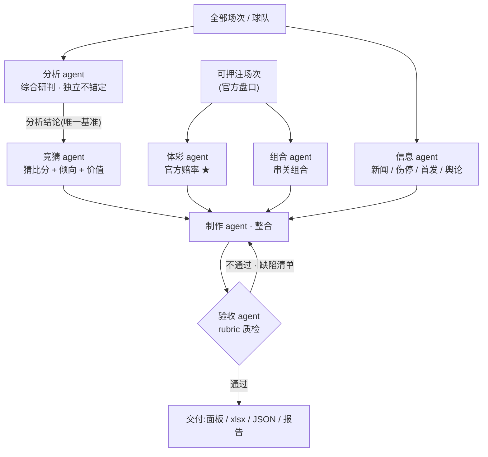
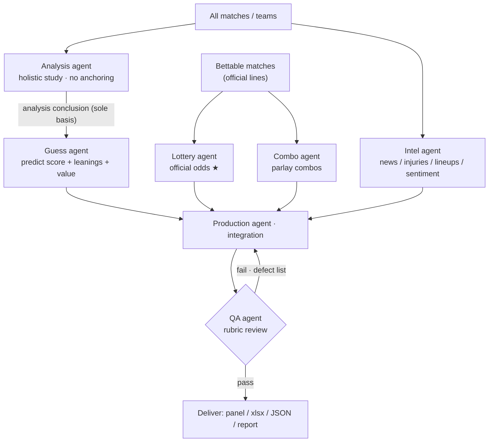
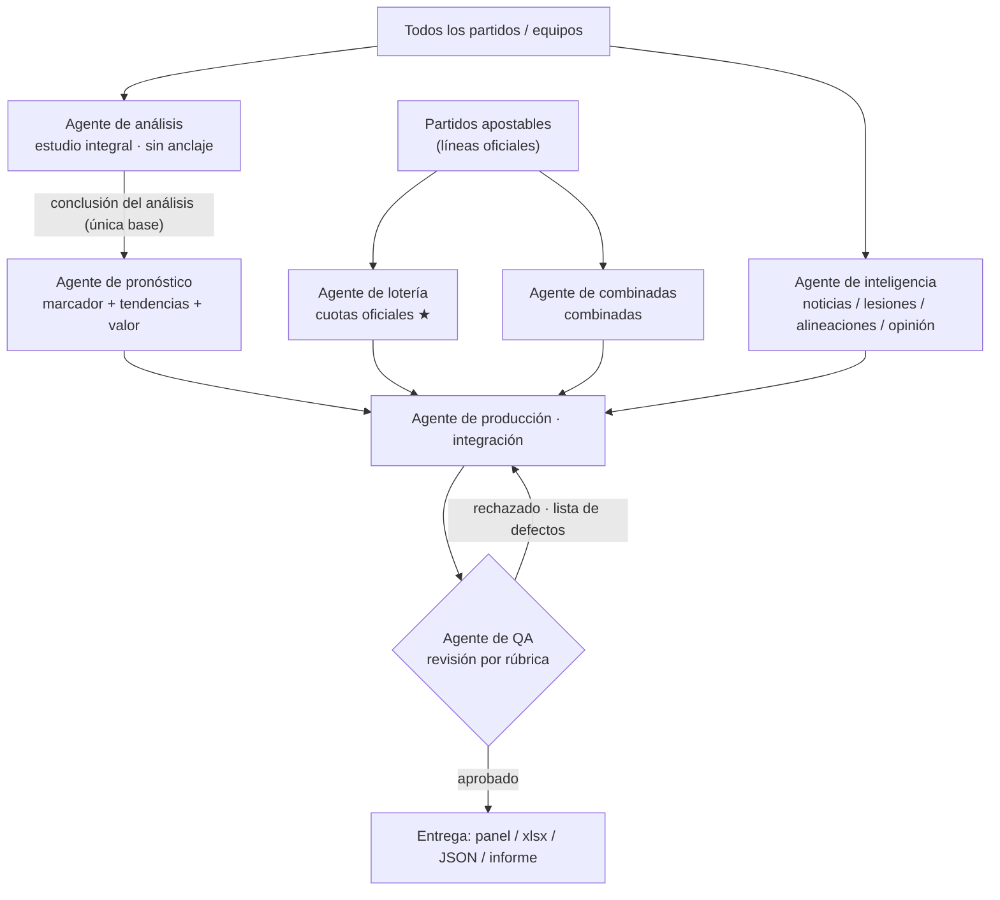
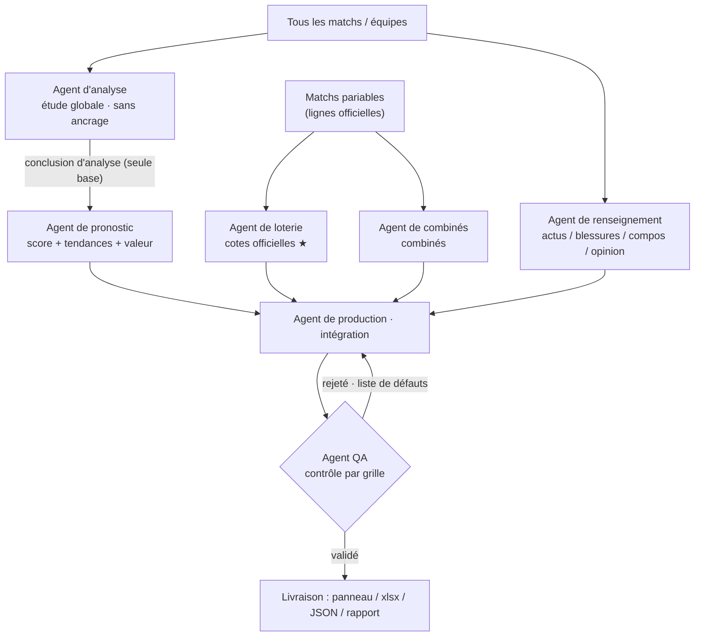
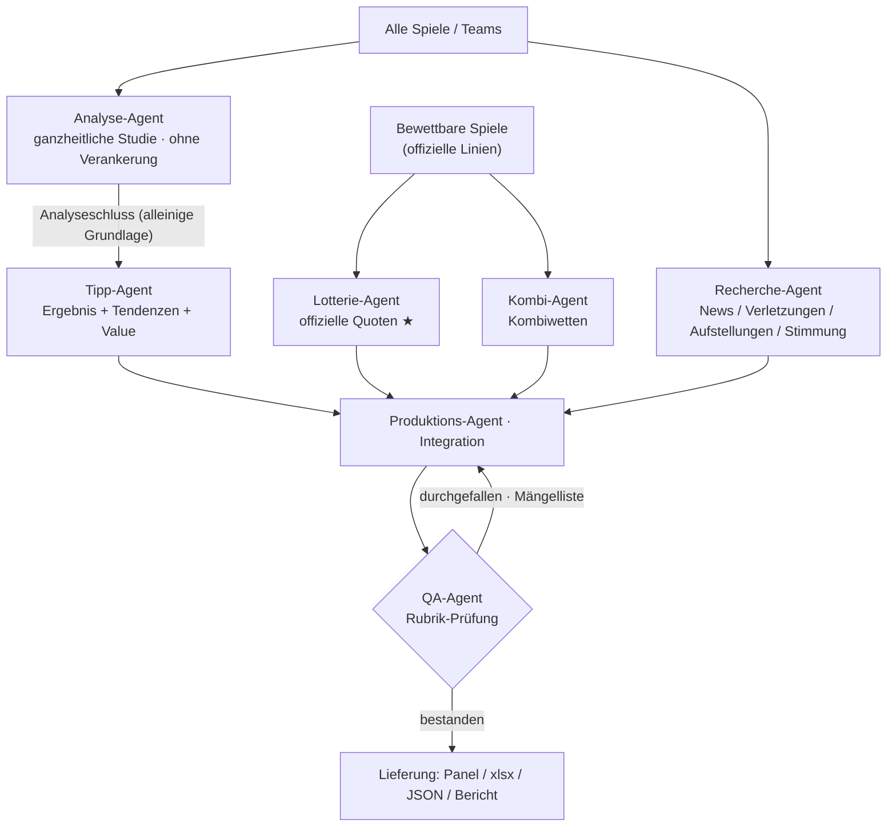
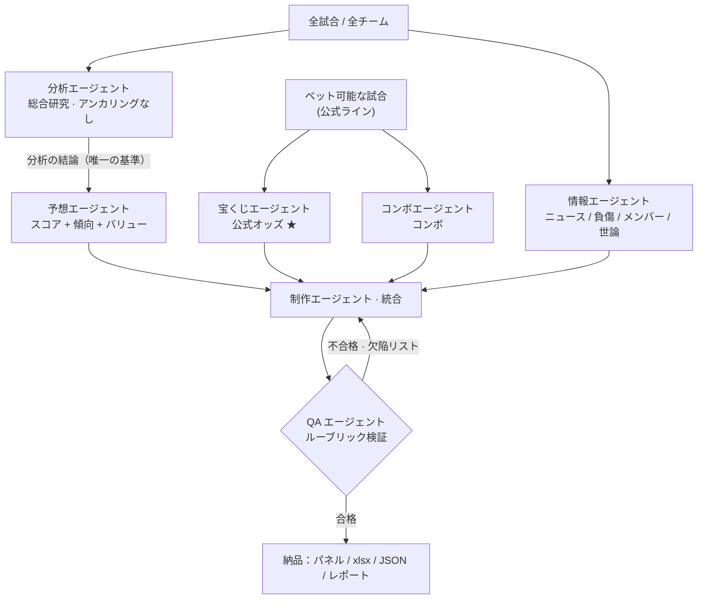
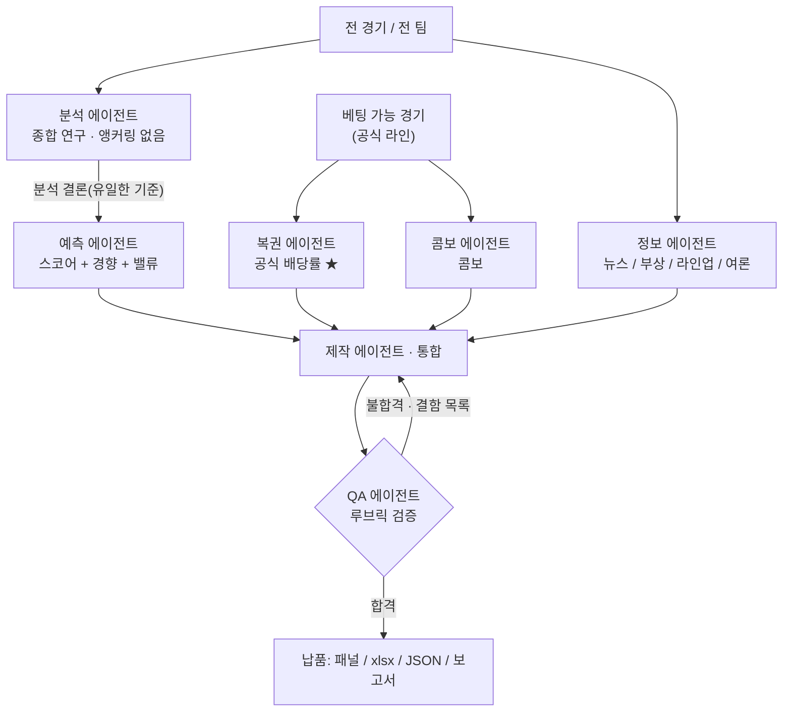
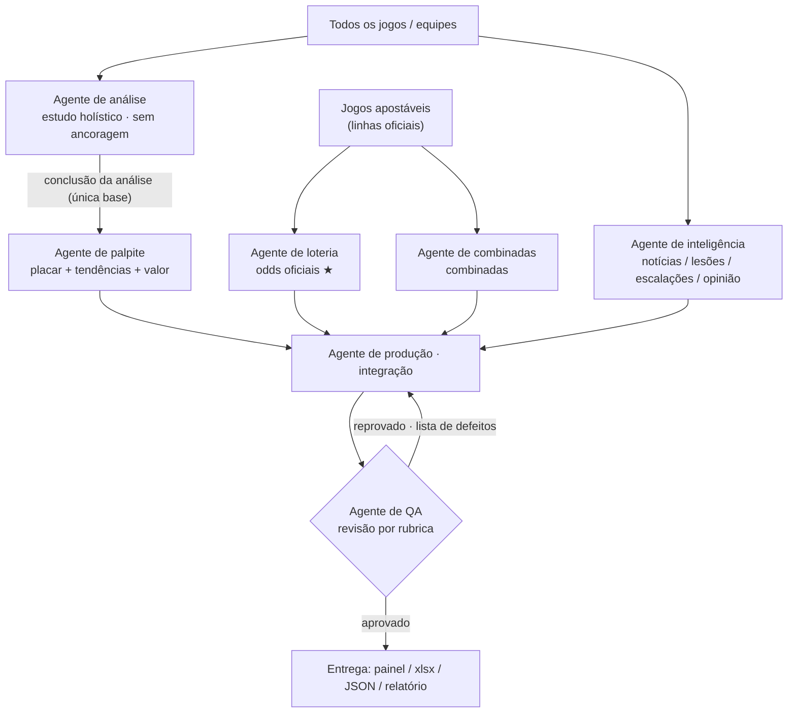
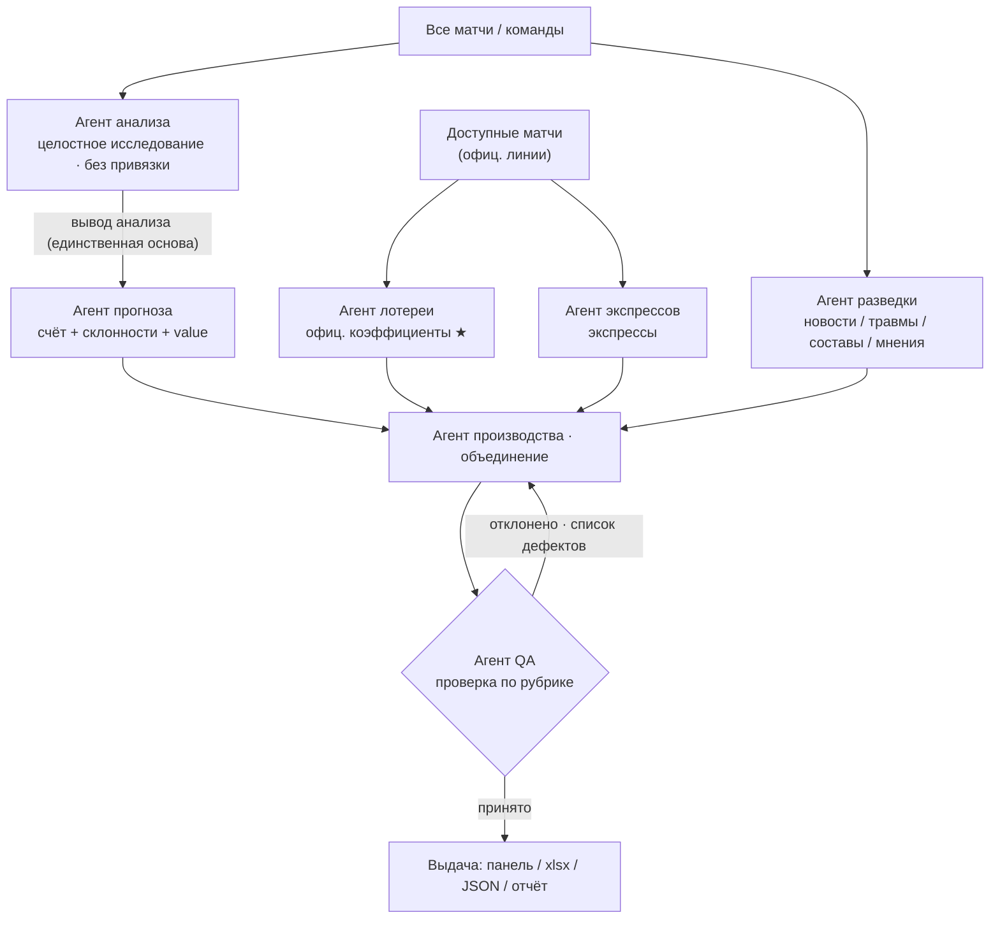

<div align="center">

# ⚽ AI-Agent-Lottery-Betting-FIFA-World-Cup

### 2026 FIFA World Cup · Lottery Betting Assistant (Multi-Agent System)

*An HTML locally-deployed website that integrates all the World Cup lottery information, aiming to help bettors make better choices.*

[](LICENSE)
[](#)
[](#)
[](#)
[](#)
[](#)

**🌐 Languages / 语言:** [简体中文](#lang-zh) · [English](#lang-en) · [Español](#lang-es) · [Français](#lang-fr) · [Deutsch](#lang-de) · [日本語](#lang-ja) · [한국어](#lang-ko) · [Português](#lang-pt) · [Русский](#lang-ru)

<sub>Click a language to jump and expand · 点击语言跳转并展开</sub>

</div>

---

<a id="lang-zh"></a>
<details open>
<summary>🌐 <b>简体中文 <sub>(Chinese)</sub></b></summary>

## 📖 项目简介

本项目是一个**纯前端、可本地部署**的 2026 世界杯竞猜投注辅助系统,最重要的目标只有一个:**辅助体彩竞猜押注**。它把全部 104 场赛程、竞彩官方赔率、球队大名单与首发、伤停舆情、历史交锋与本届实时战况,整合进一个可双击打开的单文件网页 `index.html`,并配套一份多工作表的结构化 Excel 数据库。

与普通"赛事面板"不同,本项目的数据与研判由一套**多 Agent 协作体系**生产:分析、竞猜、体彩、组合、信息五类生产 Agent 各司其职,经制作 Agent 整合、验收 Agent 按 rubric 把关后才交付到面板。整个流程遵循一条不可逾越的红线——**绝不编造数据**:抓不到的标「待更新」,模型推算的标「参考·模型」,竞彩官方实测的标「★竞彩官方」并注明来源与抓取时间。

> ⚠️ **理性娱乐,未成年人禁止购彩。** 面板所有奖金均为税前理论值,实际开奖以中国体育彩票官方为准。

---

## ✨ 核心特性

面板(`index.html`)是一个自包含的单页应用,无需后端、无需安装,双击即用,包含八个功能页签:**竞猜投注、比赛详情/观赛/分析、组合计算、赛程比分、小组排名、球队总表、全国竞猜活动、新闻**。投注页支持竞彩全玩法(胜平负、让球胜平负、比分、总进球、半全场),内置可勾选赔率的**串关/单关计算器**(单注基准 2 元,自动按所选赔率连乘或求和算奖)。

数据层做到**三处一致**:同一场比赛的数据在「单场 JSON ↔ 面板 `M` 数组 ↔ Excel ⑩ 单场详情」三处必须完全相同,改一处即同步三处。页面右下角还内置一个**嵌入式 AI 助手**(`世界杯AI助手.js`),支持悬浮窗对话、选中文本提问、自动切页/查找/读取页面,默认走 Puter·GLM 免 Key 运行,可热插拔技能 / 连接器 / MCP。

整套数据通过**分级定时任务**自动维护:每天 17:00 全量刷新,临场按小时→半小时→10 分钟逐级加密刷新赔率,赛后约 6 小时回填单场数据库。主动更新仅在**北京时间 11:00–22:30** 进行。

---

## 🧩 多 Agent 体系

项目的核心是 `子代理体系/` 下定义的协作流水线。各 Agent 既是可移植的标准子代理定义,也是主 Claude 可按段执行的 SOP。

| Agent | 职责 | 处理对象 |
|---|---|---|
| **分析 agent** | 全场次综合研判:综合新闻 / 短视频 / 资讯 / 大名单 / 客观数据,重点结合本届实际战况(小组赛看出线与对决,淘汰赛看形势)。**独立不锚定**,可与赔率、积分相反 | 全部场次 + 全部球队 |
| **竞猜 agent** | 据分析 agent 结论猜比分(pred),派生胜平负 / 让球 / 总进球 / 半全场倾向与价值、凯利 | 未开赛场次 |
| **体彩 agent** | 竞彩官方赔率全玩法,区分「★官方」与「参考·模型」 | 可押注场次 |
| **组合 agent** | 串关组合计算:按目标收益枚举达标组合,概率排序 + 分类 | 可押注场次 |
| **信息 agent** | 新闻 / 自媒体 / 伤停 / 首发 / 舆论的跨平台抓取与初筛 | 全部场次 |
| **制作 agent** | 整合五方产出 → 面板 HTML / xlsx / 单场 JSON / 报告 docx | 交付物 |
| **验收 agent** | 按 rubric 质检,不合格令制作 agent 重构后复验(≤3 轮) | 交付物 |

数据流如下——分析结论是竞猜的**唯一基准**(竞猜读分析,分析不读竞猜),最终所有产出都要过验收这一关:



---

## 🗂️ 项目结构

| 路径 | 说明 |
|---|---|
| `index.html` | **核心面板**。自包含单文件,浏览器双击即开,含全玩法赔率、投注计算器、比赛详情、历史战绩、分析预测 |
| `世界杯AI助手.js` | 嵌入式 AI 助手本体(样式 + 界面 + 双 Provider + 技能引擎) |
| `2026世界杯数据库.xlsx` | 多工作表结构化数据库(竞猜、赛程比分、小组排名、球队、大名单、首发、新闻、分析预测、近期战绩等) |
| `子代理体系/` | 七大 Agent 定义 + `README_编排.md` 编排说明 |
| `比赛数据库/` | 单场比赛 JSON 数据库(录像 / 红黄牌 / 阵型 / xG 等客观数据 / 分析 / 赔率 / 来源),含模板与验收报告 |
| `docs/官方数据抓取指南.md` | 用 Claude in Chrome 调体彩官网取官方数据的唯一指定方法 |
| `部署/` | 本地、局域网(微信扫码)、公网三类部署脚本与说明 |
| `CLAUDE.md` · `项目说明_维护手册.md` · `能力与自主性清单.md` | 常驻工作准则、维护手册、能力清单 |
| `glm-proxy.mjs` · `AI助手_演示.html` · `AI助手_使用说明.md` | 可选 GLM 代理、助手离线演示页与使用说明 |

---

## 🔌 官方数据获取(竞彩赔率 + 赛程)

竞彩官方 SP **只能**经浏览器在体彩官网同源调用官方接口取得——`web_fetch`、`WebSearch`(仅美区)、`curl/python` 直连均取不到。因此官方数据的唯一指定路径是:在 Chrome 安装并连接「Claude in Chrome」插件,`navigate` 到 `sporttery.cn` 取得 tabId 后,在页面上下文内 `fetch` 官方接口 `getMatchCalculatorV1.qry?poolCode=had,hhad,crs,ttg,hafu`,即可拿到五玩法赔率与在售赛程,再按字段映射写入面板。详见 [`docs/官方数据抓取指南.md`](docs/官方数据抓取指南.md)。

竞彩售卖规则同样内置到面板状态机:每天 11:00 开售次三日、22:00(周末 23:00)封次日盘,等价于每场「开盘 = 赛前第 3 天 11:00、封盘 ≈ 赛前一晚 22:00」,最终以接口实际在售列表为准。

---

## ⏰ 定时任务

所有时间均为**北京时间**,主动更新仅 11:00–22:30,其余时段静默。

| 任务 | 频率 | 作用 |
|---|---|---|
| `worldcup-2026-daily-update` | 每天 17:00 | 全量:比分 / 排名 / 名单首发 / 新闻 / 历史战绩 / 分析预测 / 淘汰剔除 |
| `wc-odds-*`(分级) | 11–13 点每时 → 14–20 点每半时 → 20–22 点每 10 分 | 临场赔率与即时比分逐级加密刷新 |
| `wc-outright-odds` | 小组赛每 3 天 / 淘汰赛起每天 | 冠军、冠亚军盘 |
| `wc-match-db-6h` | 12 / 15 / 18 / 22 点检查 | 赛后约 6 小时回填单场 JSON + xlsx⑩ + 面板 M,并验收 |

---

## 🚀 快速开始

最简单的方式是直接双击根目录的 `index.html` 用浏览器打开,它读取的就是会被定时任务更新的原文件,刷新即见最新。

若要在**手机 / 微信**(同一 WiFi)查看,运行 `部署/1-本地与微信局域网(自动更新)/` 里的扫码脚本,手机扫码即可打开,同样自动更新。若要分享到**公网**,用 `部署/2-公网上传快照(需重传更新)/` 生成快照并拖到 Netlify Drop——注意公网托管的是快照副本,数据更新后需重新上传(或用内网穿透把本地自动更新的服务暴露为公网地址)。详见 [`部署/部署总说明.md`](部署/部署总说明.md)。

---

## ⚙️ 配置与注意事项

### API Key 需自行替换

**本仓库不内置任何密钥。** 嵌入式 AI 助手默认走 **Puter 模式**(浏览器原生、免 API Key、免费,user-pays,首次可能弹出 Puter 登录),克隆后开箱即用。若要改用 **GLM 官方**接口,需到 [bigmodel.cn](https://bigmodel.cn) 免费注册,并在面板「**⚙ 设置 → Provider 选 GLM 官方**」中填入**你自己的 API Key**(代码里 `glmKey` 默认为空,不存在可直接套用的现成 Key)。Key 仅保存在你本机浏览器的 `localStorage`,**不会上传、也不应提交到仓库**——`.gitignore` 已排除 `*.local`、`.env`、`secrets.*` 等,请勿把 Key 或内网穿透 token 写进任何会被提交的文件。

浏览器从本地 `file://` 直连 `open.bigmodel.cn` 可能被 **CORS** 拦截。最省事的办法是直接用默认 Puter 模式;若坚持用 GLM 官方 Key,可运行随附的零依赖本地代理 `node glm-proxy.mjs`(需 Node 18+),再把请求端点 `glmBase` 改为 `http://localhost:8787/v4/chat/completions`——该代理只做透传 + 补 CORS 头,不存储任何密钥。更多细节见 [`AI助手_使用说明.md`](AI助手_使用说明.md)。

### 定时任务需自行配置

上文「定时任务」表中的各 cron 任务依赖 Claude 桌面端的计划任务能力,**仅在桌面 App 打开时运行**;首次联网需授权,建议每个任务先点一次 **Run now** 预授权。所有时间均为**北京时间**,主动更新只在 **11:00–22:30**,其余时段静默。若你 fork 本项目,需在自己的环境**重新建立**这些任务;同时注意**避免重复任务**——例如旧的通用 `data` 任务若与 17:00 全量任务时间重叠,应禁用或删除,以免重复运行。

> 🔐 **小结**:Key 自备、只存本机、永不入库;定时任务自建、仅 App 开启时按北京时间窗口运行。

---

## ⚖️ 免责声明

本项目仅用于个人学习、技术研究与赛事信息聚合,所有赔率、比分、奖金均为参考或税前理论值,**实际以中国体育彩票官方开奖为准**。请遵守所在地区法律法规。

**理性娱乐,量力而行,未成年人禁止购彩。**

</details>

<a id="lang-en"></a>
<details>
<summary>🌐 <b>English <sub>(English)</sub></b></summary>

## 📖 Overview

This project is a **pure front-end, locally-deployable** assistant for the 2026 FIFA World Cup lottery, with a single overriding goal: **to help bettors make better choices on the China Sports Lottery (竞彩/体彩)**. It integrates all 104 fixtures, official lottery odds, squad lists and lineups, injuries and public sentiment, head-to-head history and live tournament form into one self-contained web page (`index.html`) that opens with a double-click, backed by a multi-sheet structured Excel database.

Unlike an ordinary "match dashboard", the data and judgments here are produced by a **multi-agent collaboration system**: five production agents — analysis, guess, lottery, combo and intel — each play a distinct role, then a production agent integrates everything and a QA agent vets it against a rubric before delivery. The whole pipeline follows one inviolable rule — **never fabricate data**: what cannot be fetched is marked "to be updated", model-derived values are marked "reference · model", and official lottery values are marked "★ Official" with their source and fetch time.

> ⚠️ **For entertainment only. Minors are prohibited from purchasing lottery tickets.** All payouts shown are pre-tax theoretical values; actual results are determined by the official China Sports Lottery.

---

## ✨ Key Features

The panel (`index.html`) is a self-contained single-page app — no backend, no install, just double-click to use — with eight tabs: **Betting, Match Details/Watch, Combo Calculator, Fixtures & Scores, Group Standings, Team Overview, Fujian & Zhejiang Lottery Events, and News**. The betting tab supports all lottery markets (1X2, handicap 1X2, correct score, total goals, half-time/full-time) and includes a built-in **parlay/single calculator** (base stake of 2 yuan, automatically multiplying or summing the selected odds).

The data layer enforces **three-way consistency**: each match's data must be identical across "single-match JSON ↔ panel `M` array ↔ Excel sheet ⑩ Match Details" — change one, sync all three. The page also embeds an **AI assistant** (`世界杯AI助手.js`) in the bottom-right corner, supporting floating-window chat, ask-on-text-selection, and automatic tab-switching/search/page reading. It runs by default on Puter·GLM with no API key required, and supports hot-pluggable skills / connectors / MCP.

The entire dataset is maintained automatically by **tiered scheduled tasks**: a full refresh at 17:00 daily, odds refreshed in tightening intervals (hourly → half-hourly → 10-minute) near kickoff, and the single-match database backfilled about 6 hours after each match. Active updates run only during **Beijing time 11:00–22:30**.

---

## 🧩 Multi-Agent System

The core of the project is the collaboration pipeline defined under `子代理体系/`. Each agent serves both as a portable standard sub-agent definition and as an SOP the main Claude can execute section by section.

| Agent | Role | Scope |
|---|---|---|
| **Analysis** | Holistic study of every fixture: synthesizes news / short videos / intel / squads / objective data, focusing on this tournament's actual form (group stage = qualification + matchups; knockouts = situation). **Independent, no anchoring** — may contradict odds or standings | All matches + all teams |
| **Guess** | Predicts the score (pred) from the analysis agent's conclusions, deriving 1X2 / handicap / total-goals / HT-FT leanings plus value & Kelly | Upcoming matches |
| **Lottery** | All official lottery markets, distinguishing "★ Official" from "reference · model" | Bettable matches |
| **Combo** | Parlay calculations: enumerates combos meeting a target return, ranked by probability and classified | Bettable matches |
| **Intel** | Cross-platform fetching and screening of news / social media / injuries / lineups / sentiment | All matches |
| **Production** | Integrates the five outputs → panel HTML / xlsx / single-match JSON / report docx | Deliverables |
| **QA** | Reviews against a rubric; sends failures back to the production agent for rebuild and re-review (≤3 rounds) | Deliverables |

The data flow is below — the analysis conclusion is the **sole basis** for guessing (guess reads analysis; analysis never reads guess), and every output must pass QA:



---

## 🗂️ Project Structure

| Path | Description |
|---|---|
| `index.html` | **Core panel.** Self-contained single file, opens in a browser with a double-click; includes all markets, the betting calculator, match details, historical records and analysis/predictions |
| `世界杯AI助手.js` | The embedded AI assistant (styles + UI + dual provider + skill engine) |
| `2026世界杯数据库.xlsx` | Multi-sheet structured database (betting, fixtures & scores, standings, teams, squads, lineups, news, analysis/prediction, recent form, etc.) |
| `子代理体系/` | The seven agent definitions + `README_编排.md` orchestration notes |
| `比赛数据库/` | Single-match JSON database (footage / cards / formations / objective data such as xG / analysis / odds / sources), with a template and QA reports |
| `docs/官方数据抓取指南.md` | The designated method for fetching official data via Claude in Chrome on the lottery website |
| `部署/` | Deployment scripts and notes for local, LAN (WeChat QR), and public-web modes |
| `CLAUDE.md` · `项目说明_维护手册.md` · `能力与自主性清单.md` | Standing working rules, maintenance manual, capability checklist |
| `glm-proxy.mjs` · `AI助手_演示.html` · `AI助手_使用说明.md` | Optional GLM proxy, offline assistant demo, and usage notes |

---

## 🔌 Fetching Official Data (lottery odds + fixtures)

Official lottery SP values **can only** be obtained through a browser making a same-origin call to the official lottery API — `web_fetch`, `WebSearch` (US-only), and direct `curl/python` all fail. The designated path is therefore: install and connect the "Claude in Chrome" extension, `navigate` to `sporttery.cn` to obtain a tabId, then `fetch` the official API `getMatchCalculatorV1.qry?poolCode=had,hhad,crs,ttg,hafu` from within the page context to retrieve odds for all five markets and the on-sale fixtures, then map the fields into the panel. See [`docs/官方数据抓取指南.md`](docs/官方数据抓取指南.md).

The lottery sales rules are also built into the panel's state machine: sales open three days ahead at 11:00 and close the next day's lines at 22:00 (23:00 on weekends) — equivalent to "open = 3 days before, 11:00; close ≈ the night before, 22:00" per match — with the API's actual on-sale list as the final authority.

---

## ⏰ Scheduled Tasks

All times are **Beijing time**; active updates run only 11:00–22:30, silent otherwise.

| Task | Frequency | Purpose |
|---|---|---|
| `worldcup-2026-daily-update` | Daily 17:00 | Full refresh: scores / standings / squads & lineups / news / historical form / analysis & predictions / elimination cleanup |
| `wc-odds-*` (tiered) | Hourly 11–13 → half-hourly 14–20 → 10-min 20–22 | Live odds and scores, refreshed in tightening intervals near kickoff |
| `wc-outright-odds` | Every 3 days (group) / daily (from knockouts) | Champion and to-reach-final markets |
| `wc-match-db-6h` | Checks at 12 / 15 / 18 / 22 | Backfills single-match JSON + xlsx ⑩ + panel M ~6h after a match, then QA |

---

## 🚀 Quick Start

The simplest way is to double-click `index.html` in the root and open it in a browser; it reads the very file the scheduled tasks update, so a refresh shows the latest.

To view on **mobile / WeChat** (same Wi-Fi), run the QR script in `部署/1-本地与微信局域网(自动更新)/` and scan it — also auto-updating. To share to the **public web**, use `部署/2-公网上传快照(需重传更新)/` to generate a snapshot and drag it to Netlify Drop — note that public hosting serves a snapshot copy and must be re-uploaded after data changes (or use a tunnel to expose the locally auto-updating service as a public URL). See [`部署/部署总说明.md`](部署/部署总说明.md).

---

## ⚙️ Configuration & Notes

### The API key must be supplied by you

**This repository ships with no secret keys.** The embedded AI assistant defaults to **Puter mode** (browser-native, no API key, free, user-pays; a Puter login may pop up on first use), so it works out of the box after cloning. To switch to the **GLM official** API, register for free at [bigmodel.cn](https://bigmodel.cn) and enter **your own API key** under the panel's "**⚙ Settings → Provider → GLM Official**" (the code's `glmKey` is empty by default; there is no ready-made key to reuse). The key is stored only in your browser's `localStorage`, is **never uploaded, and must not be committed** — `.gitignore` already excludes `*.local`, `.env`, `secrets.*`, etc. Never write keys or tunnel tokens into any file that will be committed.

A browser connecting from local `file://` to `open.bigmodel.cn` may be blocked by **CORS**. The easiest fix is to use the default Puter mode; if you insist on a GLM official key, run the bundled zero-dependency local proxy `node glm-proxy.mjs` (Node 18+) and change the endpoint `glmBase` to `http://localhost:8787/v4/chat/completions` — the proxy only relays and adds CORS headers, storing no secrets. See [`AI助手_使用说明.md`](AI助手_使用说明.md) for details.

### Scheduled tasks must be set up by you

The cron tasks in the table above rely on Claude desktop's scheduled-task capability and **run only while the desktop app is open**; the first network access requires authorization, so it is recommended to click **Run now** once per task to pre-authorize. All times are **Beijing time**, with active updates only in the **11:00–22:30** window. If you fork this project, you must **re-create** these tasks in your own environment, and watch out for **duplicate tasks** — e.g., if an old generic `data` task overlaps the 17:00 full update, disable or delete it to avoid running twice.

> 🔐 **In short:** bring your own key, keep it local, never commit it; set up the scheduled tasks yourself, running only while the app is open within the Beijing-time window.

---

## ⚖️ Disclaimer

This project is for personal study, technical research and match-information aggregation only. All odds, scores and payouts are reference or pre-tax theoretical values; **actual results are determined by the official China Sports Lottery**. Please comply with the laws and regulations of your region.

**Play responsibly, within your means. Minors are prohibited from purchasing lottery tickets.**

</details>

<a id="lang-es"></a>
<details>
<summary>🌐 <b>Español <sub>(Spanish)</sub></b></summary>

## 📖 Descripción general

Este proyecto es un asistente **de front-end puro y desplegable localmente** para la lotería de la Copa Mundial 2026, con un único objetivo primordial: **ayudar a los apostadores a elegir mejor en la Lotería Deportiva de China (竞彩/体彩)**. Integra los 104 partidos, las cuotas oficiales de la lotería, las listas y alineaciones, las lesiones y la opinión pública, el historial de enfrentamientos y la forma en vivo del torneo en una única página web autónoma (`index.html`) que se abre con doble clic, respaldada por una base de datos Excel estructurada de varias hojas.

A diferencia de un "panel de partidos" corriente, aquí los datos y los juicios los produce un **sistema de colaboración multiagente**: cinco agentes de producción — análisis, pronóstico, lotería, combinadas e inteligencia — desempeñan cada uno un papel distinto; luego un agente de producción lo integra todo y un agente de control de calidad lo verifica con una rúbrica antes de la entrega. Todo el flujo sigue una regla inviolable — **nunca inventar datos**: lo que no se puede obtener se marca como "pendiente de actualizar", los valores derivados de modelos se marcan como "referencia · modelo", y los valores oficiales de la lotería se marcan como "★ Oficial" con su fuente y hora de obtención.

> ⚠️ **Solo para entretenimiento. Está prohibida la compra de lotería a menores de edad.** Todos los premios mostrados son valores teóricos antes de impuestos; los resultados reales los determina la Lotería Deportiva oficial de China.

---

## ✨ Características principales

El panel (`index.html`) es una aplicación de página única y autónoma — sin backend, sin instalación, basta un doble clic — con ocho pestañas: **Apuestas, Detalles del partido, Calculadora de combinadas, Calendario y resultados, Clasificación de grupos, Resumen de equipos, Eventos de lotería de Fujian y Zhejiang, y Noticias**. La pestaña de apuestas admite todos los mercados de la lotería (1X2, hándicap 1X2, marcador exacto, total de goles, descanso/final) e incluye una **calculadora de combinadas/simples** (apuesta base de 2 yuanes, que multiplica o suma automáticamente las cuotas seleccionadas).

La capa de datos impone una **coherencia triple**: los datos de cada partido deben ser idénticos en "JSON de partido individual ↔ array `M` del panel ↔ hoja Excel ⑩ Detalles del partido" — cambia uno, sincroniza los tres. La página también incorpora un **asistente de IA** (`世界杯AI助手.js`) en la esquina inferior derecha, con chat en ventana flotante, preguntar al seleccionar texto, y cambio de pestaña/búsqueda/lectura de página automáticos. Funciona por defecto con Puter·GLM sin necesidad de clave de API, y admite habilidades / conectores / MCP conectables en caliente.

Todo el conjunto de datos se mantiene automáticamente mediante **tareas programadas escalonadas**: una actualización completa a las 17:00 cada día, cuotas refrescadas en intervalos cada vez más cortos (cada hora → cada media hora → cada 10 minutos) cerca del inicio, y la base de datos de partidos individuales rellenada unas 6 horas después de cada partido. Las actualizaciones activas se ejecutan solo durante el **horario de Pekín 11:00–22:30**.

---

## 🧩 Sistema multiagente

El núcleo del proyecto es la cadena de colaboración definida en `子代理体系/`. Cada agente sirve a la vez como definición de subagente estándar portable y como SOP que el Claude principal puede ejecutar sección por sección.

| Agente | Función | Alcance |
|---|---|---|
| **Análisis** | Estudio integral de cada partido: sintetiza noticias / vídeos cortos / inteligencia / plantillas / datos objetivos, centrándose en la forma real de este torneo (fase de grupos = clasificación + enfrentamientos; eliminatorias = situación). **Independiente, sin anclaje** — puede contradecir cuotas o clasificación | Todos los partidos + todos los equipos |
| **Pronóstico** | Predice el marcador (pred) a partir de las conclusiones del agente de análisis, derivando tendencias 1X2 / hándicap / total de goles / descanso-final más valor y Kelly | Próximos partidos |
| **Lotería** | Todos los mercados oficiales de la lotería, distinguiendo "★ Oficial" de "referencia · modelo" | Partidos apostables |
| **Combinadas** | Cálculos de combinadas: enumera combinaciones que alcanzan un objetivo de ganancia, ordenadas por probabilidad y clasificadas | Partidos apostables |
| **Inteligencia** | Obtención y filtrado entre plataformas de noticias / redes sociales / lesiones / alineaciones / opinión | Todos los partidos |
| **Producción** | Integra las cinco salidas → panel HTML / xlsx / JSON de partido / informe docx | Entregables |
| **Control de calidad** | Revisa con una rúbrica; devuelve los fallos al agente de producción para reconstrucción y nueva revisión (≤3 rondas) | Entregables |

El flujo de datos es el siguiente — la conclusión del análisis es la **única base** del pronóstico (el pronóstico lee el análisis; el análisis nunca lee el pronóstico), y toda salida debe pasar el control de calidad:



---

## 🗂️ Estructura del proyecto

| Ruta | Descripción |
|---|---|
| `index.html` | **Panel principal.** Archivo único autónomo, se abre en el navegador con doble clic; incluye todos los mercados, la calculadora de apuestas, detalles de partidos, historial y análisis/predicciones |
| `世界杯AI助手.js` | El asistente de IA incorporado (estilos + interfaz + proveedor dual + motor de habilidades) |
| `2026世界杯数据库.xlsx` | Base de datos estructurada de varias hojas (apuestas, calendario y resultados, clasificación, equipos, plantillas, alineaciones, noticias, análisis/predicción, forma reciente, etc.) |
| `子代理体系/` | Las siete definiciones de agentes + notas de orquestación `README_编排.md` |
| `比赛数据库/` | Base de datos JSON de partidos individuales (metraje / tarjetas / formaciones / datos objetivos como xG / análisis / cuotas / fuentes), con plantilla e informes de QA |
| `docs/官方数据抓取指南.md` | El método designado para obtener datos oficiales mediante Claude in Chrome en el sitio de la lotería |
| `部署/` | Scripts y notas de despliegue para modos local, LAN (QR de WeChat) y web pública |
| `CLAUDE.md` · `项目说明_维护手册.md` · `能力与自主性清单.md` | Reglas de trabajo permanentes, manual de mantenimiento, lista de capacidades |
| `glm-proxy.mjs` · `AI助手_演示.html` · `AI助手_使用说明.md` | Proxy GLM opcional, demo offline del asistente y notas de uso |

---

## 🔌 Obtención de datos oficiales (cuotas + calendario)

Los valores SP oficiales de la lotería **solo** pueden obtenerse a través de un navegador que realice una llamada del mismo origen a la API oficial — `web_fetch`, `WebSearch` (solo EE. UU.) y `curl/python` directos fallan todos. Por tanto, la vía designada es: instalar y conectar la extensión "Claude in Chrome", `navigate` a `sporttery.cn` para obtener un tabId, y luego `fetch` de la API oficial `getMatchCalculatorV1.qry?poolCode=had,hhad,crs,ttg,hafu` desde el contexto de la página para recuperar las cuotas de los cinco mercados y los partidos a la venta, y mapear los campos en el panel. Véase [`docs/官方数据抓取指南.md`](docs/官方数据抓取指南.md).

Las reglas de venta de la lotería también están integradas en la máquina de estados del panel: la venta abre tres días antes a las 11:00 y cierra las líneas del día siguiente a las 22:00 (23:00 los fines de semana) — equivalente a "apertura = 3 días antes, 11:00; cierre ≈ la noche anterior, 22:00" por partido — siendo la lista real a la venta de la API la autoridad final.

---

## ⏰ Tareas programadas

Todos los horarios son **hora de Pekín**; las actualizaciones activas se ejecutan solo de 11:00 a 22:30, en silencio el resto del tiempo.

| Tarea | Frecuencia | Propósito |
|---|---|---|
| `worldcup-2026-daily-update` | Diaria 17:00 | Actualización completa: resultados / clasificación / plantillas y alineaciones / noticias / forma histórica / análisis y predicciones / limpieza de eliminados |
| `wc-odds-*` (escalonada) | Cada hora 11–13 → cada media hora 14–20 → cada 10 min 20–22 | Cuotas y resultados en vivo, refrescados en intervalos cada vez más cortos cerca del inicio |
| `wc-outright-odds` | Cada 3 días (grupos) / diaria (desde eliminatorias) | Mercados de campeón y de llegar a la final |
| `wc-match-db-6h` | Comprobaciones a las 12 / 15 / 18 / 22 | Rellena JSON de partido + xlsx ⑩ + panel M ~6 h después de un partido, y luego QA |

---

## 🚀 Inicio rápido

Lo más sencillo es hacer doble clic en `index.html` en la raíz y abrirlo en un navegador; lee el mismo archivo que actualizan las tareas programadas, así que al recargar se ve lo más reciente.

Para verlo en **móvil / WeChat** (misma Wi-Fi), ejecuta el script de QR en `部署/1-本地与微信局域网(自动更新)/` y escanéalo — también se actualiza automáticamente. Para compartirlo en la **web pública**, usa `部署/2-公网上传快照(需重传更新)/` para generar una instantánea y arrástrala a Netlify Drop — ten en cuenta que el alojamiento público sirve una copia instantánea y debe volver a subirse tras cada cambio de datos (o usa un túnel para exponer el servicio local autoactualizable como una URL pública). Véase [`部署/部署总说明.md`](部署/部署总说明.md).

---

## ⚙️ Configuración y notas

### Debes proporcionar tu propia clave de API

**Este repositorio no incluye ninguna clave secreta.** El asistente de IA incorporado usa por defecto el **modo Puter** (nativo del navegador, sin clave de API, gratuito, el usuario paga; puede aparecer un inicio de sesión de Puter la primera vez), por lo que funciona de inmediato tras clonarlo. Para cambiar a la API **oficial de GLM**, regístrate gratis en [bigmodel.cn](https://bigmodel.cn) e introduce **tu propia clave de API** en "**⚙ Ajustes → Proveedor → GLM Oficial**" del panel (el `glmKey` del código está vacío por defecto; no hay ninguna clave lista para reutilizar). La clave se almacena solo en el `localStorage` de tu navegador, **nunca se sube y no debe incluirse en commits** — `.gitignore` ya excluye `*.local`, `.env`, `secrets.*`, etc. Nunca escribas claves o tokens de túnel en ningún archivo que vaya a confirmarse.

Un navegador que conecte desde un `file://` local a `open.bigmodel.cn` puede ser bloqueado por **CORS**. La solución más sencilla es usar el modo Puter por defecto; si insistes en una clave oficial de GLM, ejecuta el proxy local sin dependencias incluido `node glm-proxy.mjs` (Node 18+) y cambia el endpoint `glmBase` a `http://localhost:8787/v4/chat/completions` — el proxy solo retransmite y añade cabeceras CORS, sin almacenar secretos. Véase [`AI助手_使用说明.md`](AI助手_使用说明.md) para más detalles.

### Debes configurar tú mismo las tareas programadas

Las tareas cron de la tabla anterior dependen de la capacidad de tareas programadas de Claude para escritorio y **solo se ejecutan mientras la aplicación de escritorio está abierta**; el primer acceso a la red requiere autorización, por lo que se recomienda pulsar **Run now** una vez por tarea para preautorizar. Todos los horarios son **hora de Pekín**, con actualizaciones activas solo en la ventana **11:00–22:30**. Si haces un fork de este proyecto, debes **volver a crear** estas tareas en tu propio entorno, y cuidado con las **tareas duplicadas** — p. ej., si una antigua tarea genérica `data` se solapa con la actualización completa de las 17:00, desactívala o elimínala para evitar que se ejecute dos veces.

> 🔐 **En resumen:** trae tu propia clave, mantenla local, nunca la subas; configura tú mismo las tareas programadas, que solo se ejecutan mientras la app está abierta dentro de la ventana de hora de Pekín.

---

## ⚖️ Aviso legal

Este proyecto es solo para estudio personal, investigación técnica y agregación de información de partidos. Todas las cuotas, marcadores y premios son valores de referencia o teóricos antes de impuestos; **los resultados reales los determina la Lotería Deportiva oficial de China**. Cumple las leyes y normativas de tu región.

**Juega de forma responsable y dentro de tus posibilidades. Está prohibida la compra de lotería a menores de edad.**

</details>

<a id="lang-fr"></a>
<details>
<summary>🌐 <b>Français <sub>(French)</sub></b></summary>

## 📖 Présentation

Ce projet est un assistant **purement front-end et déployable localement** pour la loterie de la Coupe du Monde 2026, avec un seul objectif primordial : **aider les parieurs à mieux choisir sur la Loterie Sportive de Chine (竞彩/体彩)**. Il intègre les 104 matchs, les cotes officielles de la loterie, les listes et compositions, les blessures et l'opinion publique, l'historique des confrontations et la forme en direct du tournoi dans une unique page web autonome (`index.html`) qui s'ouvre d'un double-clic, adossée à une base de données Excel structurée à plusieurs feuilles.

Contrairement à un simple « tableau de bord des matchs », les données et les jugements sont ici produits par un **système de collaboration multi-agents** : cinq agents de production — analyse, pronostic, loterie, combinés et renseignement — jouent chacun un rôle distinct ; ensuite, un agent de production intègre le tout et un agent d'assurance qualité le vérifie selon une grille avant la livraison. Tout le pipeline suit une règle inviolable — **ne jamais inventer de données** : ce qui ne peut être récupéré est marqué « à mettre à jour », les valeurs issues de modèles sont marquées « référence · modèle », et les valeurs officielles de la loterie sont marquées « ★ Officiel » avec leur source et leur heure de récupération.

> ⚠️ **Pour divertissement uniquement. L'achat de loterie est interdit aux mineurs.** Tous les gains affichés sont des valeurs théoriques avant impôt ; les résultats réels sont déterminés par la Loterie Sportive officielle de Chine.

---

## ✨ Fonctionnalités principales

Le panneau (`index.html`) est une application monopage autonome — sans backend, sans installation, un simple double-clic suffit — avec huit onglets : **Paris, Détails du match, Calculateur de combinés, Calendrier et scores, Classement des groupes, Aperçu des équipes, Événements de loterie du Fujian et du Zhejiang, et Actualités**. L'onglet paris prend en charge tous les marchés de la loterie (1X2, handicap 1X2, score exact, total de buts, mi-temps/fin de match) et inclut un **calculateur de combinés/simples** intégré (mise de base de 2 yuans, multipliant ou additionnant automatiquement les cotes sélectionnées).

La couche de données impose une **cohérence triple** : les données de chaque match doivent être identiques dans « JSON de match individuel ↔ tableau `M` du panneau ↔ feuille Excel ⑩ Détails du match » — on en change un, on synchronise les trois. La page embarque aussi un **assistant IA** (`世界杯AI助手.js`) en bas à droite, avec chat en fenêtre flottante, question à la sélection de texte, et changement d'onglet/recherche/lecture de page automatiques. Il fonctionne par défaut avec Puter·GLM sans clé d'API, et prend en charge compétences / connecteurs / MCP enfichables à chaud.

L'ensemble des données est maintenu automatiquement par des **tâches planifiées échelonnées** : une actualisation complète à 17:00 chaque jour, des cotes rafraîchies à intervalles de plus en plus courts (toutes les heures → toutes les demi-heures → toutes les 10 minutes) à l'approche du coup d'envoi, et la base de données des matchs individuels complétée environ 6 heures après chaque match. Les mises à jour actives ne s'exécutent que pendant **l'heure de Pékin 11:00–22:30**.

---

## 🧩 Système multi-agents

Le cœur du projet est le pipeline de collaboration défini sous `子代理体系/`. Chaque agent sert à la fois de définition de sous-agent standard portable et de SOP que le Claude principal peut exécuter section par section.

| Agent | Rôle | Portée |
|---|---|---|
| **Analyse** | Étude globale de chaque match : synthétise actualités / vidéos courtes / renseignement / effectifs / données objectives, en se concentrant sur la forme réelle de ce tournoi (phase de groupes = qualification + confrontations ; phases finales = situation). **Indépendant, sans ancrage** — peut contredire les cotes ou le classement | Tous les matchs + toutes les équipes |
| **Pronostic** | Prédit le score (pred) à partir des conclusions de l'agent d'analyse, en dérivant les tendances 1X2 / handicap / total de buts / mi-temps-fin plus la valeur et Kelly | Matchs à venir |
| **Loterie** | Tous les marchés officiels de la loterie, distinguant « ★ Officiel » de « référence · modèle » | Matchs pariables |
| **Combinés** | Calculs de combinés : énumère les combinaisons atteignant un gain cible, classées par probabilité et catégorisées | Matchs pariables |
| **Renseignement** | Récupération et tri inter-plateformes des actualités / réseaux sociaux / blessures / compositions / opinion | Tous les matchs |
| **Production** | Intègre les cinq sorties → panneau HTML / xlsx / JSON de match / rapport docx | Livrables |
| **Assurance qualité** | Vérifie selon une grille ; renvoie les échecs à l'agent de production pour reconstruction et nouvelle vérification (≤3 tours) | Livrables |

Le flux de données est le suivant — la conclusion de l'analyse est la **seule base** du pronostic (le pronostic lit l'analyse ; l'analyse ne lit jamais le pronostic), et toute sortie doit passer l'assurance qualité :



---

## 🗂️ Structure du projet

| Chemin | Description |
|---|---|
| `index.html` | **Panneau principal.** Fichier unique autonome, s'ouvre dans un navigateur d'un double-clic ; inclut tous les marchés, le calculateur de paris, les détails des matchs, l'historique et les analyses/prédictions |
| `世界杯AI助手.js` | L'assistant IA embarqué (styles + interface + double fournisseur + moteur de compétences) |
| `2026世界杯数据库.xlsx` | Base de données structurée à plusieurs feuilles (paris, calendrier et scores, classement, équipes, effectifs, compositions, actualités, analyse/prédiction, forme récente, etc.) |
| `子代理体系/` | Les sept définitions d'agents + notes d'orchestration `README_编排.md` |
| `比赛数据库/` | Base de données JSON des matchs individuels (séquences / cartons / formations / données objectives comme xG / analyse / cotes / sources), avec modèle et rapports QA |
| `docs/官方数据抓取指南.md` | La méthode désignée pour récupérer les données officielles via Claude in Chrome sur le site de la loterie |
| `部署/` | Scripts et notes de déploiement pour les modes local, LAN (QR WeChat) et web public |
| `CLAUDE.md` · `项目说明_维护手册.md` · `能力与自主性清单.md` | Règles de travail permanentes, manuel de maintenance, liste des capacités |
| `glm-proxy.mjs` · `AI助手_演示.html` · `AI助手_使用说明.md` | Proxy GLM optionnel, démo hors-ligne de l'assistant et notes d'utilisation |

---

## 🔌 Récupération des données officielles (cotes + calendrier)

Les valeurs SP officielles de la loterie **ne peuvent** être obtenues qu'à travers un navigateur effectuant un appel de même origine à l'API officielle — `web_fetch`, `WebSearch` (États-Unis uniquement) et `curl/python` directs échouent tous. La voie désignée est donc : installer et connecter l'extension « Claude in Chrome », `navigate` vers `sporttery.cn` pour obtenir un tabId, puis `fetch` de l'API officielle `getMatchCalculatorV1.qry?poolCode=had,hhad,crs,ttg,hafu` depuis le contexte de la page pour récupérer les cotes des cinq marchés et les matchs en vente, et mapper les champs dans le panneau. Voir [`docs/官方数据抓取指南.md`](docs/官方数据抓取指南.md).

Les règles de vente de la loterie sont aussi intégrées à la machine à états du panneau : la vente ouvre trois jours à l'avance à 11:00 et clôture les lignes du lendemain à 22:00 (23:00 le week-end) — équivalent à « ouverture = 3 jours avant, 11:00 ; clôture ≈ la veille au soir, 22:00 » par match — la liste réelle en vente de l'API faisant autorité en dernier ressort.

---

## ⏰ Tâches planifiées

Tous les horaires sont à **l'heure de Pékin** ; les mises à jour actives ne s'exécutent que de 11:00 à 22:30, en silence le reste du temps.

| Tâche | Fréquence | Objet |
|---|---|---|
| `worldcup-2026-daily-update` | Quotidien 17:00 | Actualisation complète : scores / classement / effectifs et compositions / actualités / forme historique / analyses et prédictions / nettoyage des éliminés |
| `wc-odds-*` (échelonnée) | Toutes les heures 11–13 → toutes les demi-heures 14–20 → toutes les 10 min 20–22 | Cotes et scores en direct, rafraîchis à intervalles de plus en plus courts près du coup d'envoi |
| `wc-outright-odds` | Tous les 3 jours (groupes) / quotidien (à partir des phases finales) | Marchés du champion et de la qualification en finale |
| `wc-match-db-6h` | Vérifications à 12 / 15 / 18 / 22 | Complète le JSON de match + xlsx ⑩ + panneau M ~6 h après un match, puis QA |

---

## 🚀 Démarrage rapide

Le plus simple est de double-cliquer sur `index.html` à la racine et de l'ouvrir dans un navigateur ; il lit le fichier même que les tâches planifiées mettent à jour, donc un rafraîchissement affiche la dernière version.

Pour le consulter sur **mobile / WeChat** (même Wi-Fi), exécutez le script QR dans `部署/1-本地与微信局域网(自动更新)/` et scannez-le — mise à jour automatique également. Pour le partager sur le **web public**, utilisez `部署/2-公网上传快照(需重传更新)/` pour générer un instantané et glissez-le dans Netlify Drop — notez que l'hébergement public sert une copie instantanée et doit être ré-uploadé après chaque changement de données (ou utilisez un tunnel pour exposer le service local auto-actualisé comme une URL publique). Voir [`部署/部署总说明.md`](部署/部署总说明.md).

---

## ⚙️ Configuration et remarques

### Vous devez fournir votre propre clé d'API

**Ce dépôt ne contient aucune clé secrète.** L'assistant IA embarqué utilise par défaut le **mode Puter** (natif du navigateur, sans clé d'API, gratuit, l'utilisateur paie ; une connexion Puter peut apparaître à la première utilisation), il fonctionne donc immédiatement après le clonage. Pour passer à l'API **officielle GLM**, inscrivez-vous gratuitement sur [bigmodel.cn](https://bigmodel.cn) et saisissez **votre propre clé d'API** sous « **⚙ Paramètres → Fournisseur → GLM Officiel** » du panneau (le `glmKey` du code est vide par défaut ; il n'existe aucune clé prête à réutiliser). La clé n'est stockée que dans le `localStorage` de votre navigateur, **n'est jamais téléversée et ne doit pas être commitée** — `.gitignore` exclut déjà `*.local`, `.env`, `secrets.*`, etc. N'écrivez jamais de clés ni de jetons de tunnel dans un fichier destiné à être commité.

Un navigateur se connectant depuis un `file://` local à `open.bigmodel.cn` peut être bloqué par **CORS**. La solution la plus simple est d'utiliser le mode Puter par défaut ; si vous tenez à une clé officielle GLM, lancez le proxy local sans dépendance fourni `node glm-proxy.mjs` (Node 18+) et changez le point de terminaison `glmBase` en `http://localhost:8787/v4/chat/completions` — le proxy ne fait que relayer et ajouter des en-têtes CORS, sans stocker de secrets. Voir [`AI助手_使用说明.md`](AI助手_使用说明.md) pour les détails.

### Vous devez configurer vous-même les tâches planifiées

Les tâches cron du tableau ci-dessus reposent sur la capacité de tâches planifiées de Claude pour ordinateur de bureau et **ne s'exécutent que lorsque l'application de bureau est ouverte** ; le premier accès réseau nécessite une autorisation, il est donc recommandé de cliquer une fois sur **Run now** par tâche pour pré-autoriser. Tous les horaires sont à **l'heure de Pékin**, avec des mises à jour actives uniquement dans la fenêtre **11:00–22:30**. Si vous forkez ce projet, vous devez **recréer** ces tâches dans votre propre environnement, et attention aux **tâches en double** — p. ex., si une ancienne tâche générique `data` chevauche l'actualisation complète de 17:00, désactivez-la ou supprimez-la pour éviter une double exécution.

> 🔐 **En bref :** apportez votre propre clé, gardez-la en local, ne la commitez jamais ; configurez vous-même les tâches planifiées, qui ne s'exécutent que lorsque l'app est ouverte dans la fenêtre d'heure de Pékin.

---

## ⚖️ Avertissement

Ce projet est destiné uniquement à l'étude personnelle, à la recherche technique et à l'agrégation d'informations sur les matchs. Toutes les cotes, scores et gains sont des valeurs de référence ou théoriques avant impôt ; **les résultats réels sont déterminés par la Loterie Sportive officielle de Chine**. Veuillez respecter les lois et règlements de votre région.

**Jouez de manière responsable et selon vos moyens. L'achat de loterie est interdit aux mineurs.**

</details>

<a id="lang-de"></a>
<details>
<summary>🌐 <b>Deutsch <sub>(German)</sub></b></summary>

## 📖 Überblick

Dieses Projekt ist ein **reiner Frontend-Assistent, lokal bereitstellbar**, für die Lotterie zur Weltmeisterschaft 2026 mit einem einzigen übergeordneten Ziel: **Wettenden zu besseren Entscheidungen bei der chinesischen Sportlotterie (竞彩/体彩) zu verhelfen**. Er bündelt alle 104 Spiele, offizielle Lotterie-Quoten, Kaderlisten und Aufstellungen, Verletzungen und öffentliche Stimmung, Direktvergleiche und die aktuelle Turnierform in einer einzigen, eigenständigen Webseite (`index.html`), die per Doppelklick öffnet und von einer mehrblättrigen, strukturierten Excel-Datenbank gestützt wird.

Anders als ein gewöhnliches „Spiel-Dashboard" werden die Daten und Einschätzungen hier von einem **Multi-Agenten-Kollaborationssystem** erzeugt: Fünf Produktionsagenten — Analyse, Tipp, Lotterie, Kombi und Recherche — übernehmen jeweils eine eigene Rolle; danach integriert ein Produktionsagent alles und ein QA-Agent prüft es anhand einer Rubrik vor der Auslieferung. Die gesamte Pipeline folgt einer unverrückbaren Regel — **niemals Daten erfinden**: Was nicht abgerufen werden kann, wird als „zu aktualisieren" markiert, modellabgeleitete Werte als „Referenz · Modell", und offizielle Lotteriewerte als „★ Offiziell" mit Quelle und Abrufzeit.

> ⚠️ **Nur zur Unterhaltung. Minderjährigen ist der Lotteriekauf untersagt.** Alle angezeigten Gewinne sind theoretische Vorsteuerwerte; die tatsächlichen Ergebnisse bestimmt die offizielle chinesische Sportlotterie.

---

## ✨ Hauptfunktionen

Das Panel (`index.html`) ist eine eigenständige Single-Page-App — kein Backend, keine Installation, einfach Doppelklick — mit acht Tabs: **Wetten, Spieldetails, Kombi-Rechner, Spielplan & Ergebnisse, Gruppentabellen, Team-Übersicht, Lotterie-Events Fujian & Zhejiang und Nachrichten**. Der Wetten-Tab unterstützt alle Lotteriemärkte (1X2, Handicap 1X2, genaues Ergebnis, Toranzahl, Halbzeit/Endstand) und enthält einen integrierten **Kombi-/Einzelwetten-Rechner** (Grundeinsatz 2 Yuan, der die gewählten Quoten automatisch multipliziert oder summiert).

Die Datenschicht erzwingt **dreifache Konsistenz**: Die Daten jedes Spiels müssen über „Einzelspiel-JSON ↔ Panel-Array `M` ↔ Excel-Blatt ⑩ Spieldetails" identisch sein — eines ändern, alle drei synchronisieren. Die Seite bettet zudem unten rechts einen **KI-Assistenten** (`世界杯AI助手.js`) ein, mit Chat im schwebenden Fenster, Frage bei Textauswahl sowie automatischem Tab-Wechsel/Suche/Seitenlesen. Er läuft standardmäßig mit Puter·GLM ohne API-Schlüssel und unterstützt hot-pluggable Skills / Konnektoren / MCP.

Der gesamte Datenbestand wird automatisch durch **gestaffelte geplante Aufgaben** gepflegt: eine vollständige Aktualisierung täglich um 17:00, Quoten in immer kürzeren Intervallen nahe dem Anpfiff (stündlich → halbstündlich → 10-minütlich) und die Einzelspiel-Datenbank etwa 6 Stunden nach jedem Spiel nachgetragen. Aktive Aktualisierungen laufen nur während der **Pekinger Zeit 11:00–22:30**.

---

## 🧩 Multi-Agenten-System

Der Kern des Projekts ist die unter `子代理体系/` definierte Kollaborations-Pipeline. Jeder Agent dient zugleich als portable Standard-Subagenten-Definition und als SOP, die der Haupt-Claude abschnittsweise ausführen kann.

| Agent | Rolle | Umfang |
|---|---|---|
| **Analyse** | Ganzheitliche Untersuchung jedes Spiels: synthetisiert Nachrichten / Kurzvideos / Recherche / Kader / objektive Daten mit Fokus auf die tatsächliche Form dieses Turniers (Gruppenphase = Qualifikation + Duelle; K.-o.-Runde = Lage). **Unabhängig, ohne Verankerung** — kann Quoten oder Tabellen widersprechen | Alle Spiele + alle Teams |
| **Tipp** | Sagt das Ergebnis (pred) aus den Schlussfolgerungen des Analyseagenten voraus und leitet Tendenzen für 1X2 / Handicap / Toranzahl / Halbzeit-Endstand sowie Value und Kelly ab | Kommende Spiele |
| **Lotterie** | Alle offiziellen Lotteriemärkte, unterscheidet „★ Offiziell" von „Referenz · Modell" | Bewettbare Spiele |
| **Kombi** | Kombi-Berechnungen: zählt Kombinationen auf, die einen Zielgewinn erreichen, nach Wahrscheinlichkeit sortiert und klassifiziert | Bewettbare Spiele |
| **Recherche** | Plattformübergreifendes Abrufen und Sichten von Nachrichten / Social Media / Verletzungen / Aufstellungen / Stimmung | Alle Spiele |
| **Produktion** | Integriert die fünf Ausgaben → Panel-HTML / xlsx / Einzelspiel-JSON / Bericht docx | Lieferobjekte |
| **QA** | Prüft anhand einer Rubrik; schickt Fehler an den Produktionsagenten zur Neuerstellung und erneuten Prüfung zurück (≤3 Runden) | Lieferobjekte |

Der Datenfluss sieht so aus — die Analyseschlussfolgerung ist die **alleinige Grundlage** des Tipps (Tipp liest Analyse; Analyse liest nie Tipp), und jede Ausgabe muss die QA bestehen:



---

## 🗂️ Projektstruktur

| Pfad | Beschreibung |
|---|---|
| `index.html` | **Kern-Panel.** Eigenständige Einzeldatei, öffnet im Browser per Doppelklick; enthält alle Märkte, den Wettrechner, Spieldetails, historische Daten und Analyse/Prognosen |
| `世界杯AI助手.js` | Der eingebettete KI-Assistent (Styles + UI + Dual-Provider + Skill-Engine) |
| `2026世界杯数据库.xlsx` | Strukturierte Datenbank mit mehreren Blättern (Wetten, Spielplan & Ergebnisse, Tabellen, Teams, Kader, Aufstellungen, Nachrichten, Analyse/Prognose, jüngste Form usw.) |
| `子代理体系/` | Die sieben Agenten-Definitionen + Orchestrierungs-Notizen `README_编排.md` |
| `比赛数据库/` | Einzelspiel-JSON-Datenbank (Aufnahmen / Karten / Formationen / objektive Daten wie xG / Analyse / Quoten / Quellen), mit Vorlage und QA-Berichten |
| `docs/官方数据抓取指南.md` | Die vorgesehene Methode zum Abruf offizieller Daten via Claude in Chrome auf der Lotterie-Website |
| `部署/` | Deployment-Skripte und -Notizen für lokal, LAN (WeChat-QR) und öffentliches Web |
| `CLAUDE.md` · `项目说明_维护手册.md` · `能力与自主性清单.md` | Ständige Arbeitsregeln, Wartungshandbuch, Fähigkeitsliste |
| `glm-proxy.mjs` · `AI助手_演示.html` · `AI助手_使用说明.md` | Optionaler GLM-Proxy, Offline-Demo des Assistenten und Nutzungshinweise |

---

## 🔌 Abruf offizieller Daten (Quoten + Spielplan)

Offizielle Lotterie-SP-Werte **können nur** über einen Browser abgerufen werden, der einen Same-Origin-Aufruf an die offizielle Lotterie-API tätigt — `web_fetch`, `WebSearch` (nur USA) und direktes `curl/python` scheitern allesamt. Der vorgesehene Weg lautet daher: die Erweiterung „Claude in Chrome" installieren und verbinden, mit `navigate` zu `sporttery.cn` eine tabId holen und dann aus dem Seitenkontext heraus per `fetch` die offizielle API `getMatchCalculatorV1.qry?poolCode=had,hhad,crs,ttg,hafu` aufrufen, um die Quoten aller fünf Märkte und die im Verkauf befindlichen Spiele abzurufen und die Felder ins Panel zu mappen. Siehe [`docs/官方数据抓取指南.md`](docs/官方数据抓取指南.md).

Die Verkaufsregeln der Lotterie sind ebenfalls in die Zustandsmaschine des Panels eingebaut: Der Verkauf öffnet drei Tage im Voraus um 11:00 und schließt die Linien des Folgetags um 22:00 (am Wochenende 23:00) — entspricht pro Spiel „Öffnung = 3 Tage vorher, 11:00; Schließung ≈ Vorabend, 22:00" — wobei die tatsächliche Verkaufsliste der API die endgültige Autorität ist.

---

## ⏰ Geplante Aufgaben

Alle Zeiten sind **Pekinger Zeit**; aktive Aktualisierungen laufen nur 11:00–22:30, sonst still.

| Aufgabe | Häufigkeit | Zweck |
|---|---|---|
| `worldcup-2026-daily-update` | Täglich 17:00 | Vollständige Aktualisierung: Ergebnisse / Tabellen / Kader & Aufstellungen / Nachrichten / historische Form / Analyse & Prognosen / Bereinigung ausgeschiedener Teams |
| `wc-odds-*` (gestaffelt) | Stündlich 11–13 → halbstündlich 14–20 → 10-min 20–22 | Live-Quoten und -Ergebnisse, nahe dem Anpfiff in immer kürzeren Intervallen aktualisiert |
| `wc-outright-odds` | Alle 3 Tage (Gruppe) / täglich (ab K.-o.-Runde) | Märkte für Sieger und Finaleinzug |
| `wc-match-db-6h` | Prüfungen um 12 / 15 / 18 / 22 | Trägt Einzelspiel-JSON + xlsx ⑩ + Panel M ~6 h nach einem Spiel nach, dann QA |

---

## 🚀 Schnellstart

Am einfachsten doppelklickt man `index.html` im Stammverzeichnis und öffnet es im Browser; es liest genau die Datei, die die geplanten Aufgaben aktualisieren, sodass ein Neuladen den neuesten Stand zeigt.

Zum Ansehen auf **Mobilgerät / WeChat** (gleiches WLAN) das QR-Skript in `部署/1-本地与微信局域网(自动更新)/` ausführen und scannen — ebenfalls automatisch aktualisierend. Zum Teilen im **öffentlichen Web** mit `部署/2-公网上传快照(需重传更新)/` einen Snapshot erzeugen und in Netlify Drop ziehen — beachte, dass öffentliches Hosting eine Snapshot-Kopie bereitstellt und nach jeder Datenänderung neu hochgeladen werden muss (oder einen Tunnel nutzen, um den lokal automatisch aktualisierten Dienst als öffentliche URL bereitzustellen). Siehe [`部署/部署总说明.md`](部署/部署总说明.md).

---

## ⚙️ Konfiguration und Hinweise

### Der API-Schlüssel muss von dir bereitgestellt werden

**Dieses Repository enthält keinerlei geheime Schlüssel.** Der eingebettete KI-Assistent nutzt standardmäßig den **Puter-Modus** (browser-nativ, ohne API-Schlüssel, kostenlos, user-pays; beim ersten Mal kann ein Puter-Login erscheinen) und funktioniert daher nach dem Klonen sofort. Um zur **offiziellen GLM-API** zu wechseln, registriere dich kostenlos bei [bigmodel.cn](https://bigmodel.cn) und trage **deinen eigenen API-Schlüssel** unter „**⚙ Einstellungen → Provider → GLM Offiziell**" im Panel ein (das `glmKey` im Code ist standardmäßig leer; es gibt keinen fertigen Schlüssel zur Wiederverwendung). Der Schlüssel wird nur im `localStorage` deines Browsers gespeichert, **niemals hochgeladen und darf nicht committet werden** — `.gitignore` schließt bereits `*.local`, `.env`, `secrets.*` usw. aus. Schreibe niemals Schlüssel oder Tunnel-Tokens in eine Datei, die committet wird.

Ein Browser, der von einem lokalen `file://` zu `open.bigmodel.cn` verbindet, kann durch **CORS** blockiert werden. Am einfachsten ist der Standard-Puter-Modus; wenn du auf einen offiziellen GLM-Schlüssel bestehst, starte den mitgelieferten abhängigkeitsfreien lokalen Proxy `node glm-proxy.mjs` (Node 18+) und ändere den Endpunkt `glmBase` auf `http://localhost:8787/v4/chat/completions` — der Proxy leitet nur weiter und ergänzt CORS-Header, speichert keine Geheimnisse. Details siehe [`AI助手_使用说明.md`](AI助手_使用说明.md).

### Geplante Aufgaben musst du selbst einrichten

Die Cron-Aufgaben der obigen Tabelle hängen von der Funktion für geplante Aufgaben des Claude-Desktops ab und **laufen nur, solange die Desktop-App geöffnet ist**; der erste Netzwerkzugriff erfordert eine Autorisierung, daher empfiehlt es sich, pro Aufgabe einmal **Run now** zur Vorautorisierung zu klicken. Alle Zeiten sind **Pekinger Zeit**, mit aktiven Aktualisierungen nur im Fenster **11:00–22:30**. Wenn du dieses Projekt forkst, musst du diese Aufgaben in deiner eigenen Umgebung **neu anlegen** und auf **doppelte Aufgaben** achten — z. B. eine alte generische `data`-Aufgabe deaktivieren oder löschen, falls sie sich mit der vollständigen 17:00-Aktualisierung überschneidet, um doppelte Läufe zu vermeiden.

> 🔐 **Kurz gesagt:** eigenen Schlüssel mitbringen, lokal halten, nie committen; geplante Aufgaben selbst einrichten, die nur bei geöffneter App im Pekinger-Zeit-Fenster laufen.

---

## ⚖️ Haftungsausschluss

Dieses Projekt dient ausschließlich dem persönlichen Studium, der technischen Forschung und der Aggregation von Spielinformationen. Alle Quoten, Ergebnisse und Gewinne sind Referenz- oder theoretische Vorsteuerwerte; **die tatsächlichen Ergebnisse bestimmt die offizielle chinesische Sportlotterie**. Bitte beachte die Gesetze und Vorschriften deiner Region.

**Spiele verantwortungsbewusst und im Rahmen deiner Möglichkeiten. Minderjährigen ist der Lotteriekauf untersagt.**

</details>

<a id="lang-ja"></a>
<details>
<summary>🌐 <b>日本語 <sub>(Japanese)</sub></b></summary>

## 📖 概要

本プロジェクトは、2026 FIFA ワールドカップの宝くじ向けの**純フロントエンド・ローカル展開可能**な支援ツールであり、唯一最大の目的は **中国スポーツ宝くじ（竞彩/体彩）でベッターがより良い選択をできるよう支援すること**です。全 104 試合、宝くじの公式オッズ、メンバーリストとスターティングメンバー、負傷情報や世論、対戦成績、そして大会のライブな調子を、ダブルクリックで開ける自己完結型のウェブページ（`index.html`）に統合し、複数シートの構造化 Excel データベースが裏で支えます。

通常の「試合ダッシュボード」と異なり、ここでのデータと判断は**マルチエージェント協調体制**によって生み出されます。分析・予想・宝くじ・コンボ・情報の 5 つの制作エージェントがそれぞれ役割を担い、その後、制作エージェントがすべてを統合し、QA エージェントがルーブリックで検証してから納品します。パイプライン全体は不可侵の原則に従います — **データを決して捏造しない**。取得できないものは「更新待ち」、モデル由来の値は「参考・モデル」、宝くじの公式値は「★公式」と出典・取得時刻付きで明記します。

> ⚠️ **娯楽目的のみ。未成年者の宝くじ購入は禁止です。** 表示される配当はすべて税引前の理論値であり、実際の結果は中国スポーツ宝くじ公式により決定されます。

---

## ✨ 主な機能

パネル（`index.html`）は自己完結型のシングルページアプリで、バックエンド不要・インストール不要、ダブルクリックで利用でき、8 つのタブを備えます：**ベッティング、試合詳細、コンボ計算機、日程・スコア、グループ順位、チーム一覧、福建・浙江の宝くじイベント、ニュース**。ベッティングタブは全マーケット（勝分敗、ハンディキャップ勝分敗、正確なスコア、総得点、前半/試合終了）に対応し、組み込みの**コンボ/シングル計算機**（基本掛け金 2 元、選択したオッズを自動で乗算または合算）を備えます。

データ層は**三者一致**を強制します：各試合のデータは「単一試合 JSON ↔ パネルの `M` 配列 ↔ Excel シート ⑩ 試合詳細」で同一でなければならず、1 つを変えたら 3 つを同期します。ページ右下には**AI アシスタント**（`世界杯AI助手.js`）も組み込まれており、フローティングウィンドウでのチャット、テキスト選択時の質問、タブ自動切替・検索・ページ読み取りに対応します。既定では Puter·GLM で API キー不要で動作し、ホットプラグ可能なスキル / コネクタ / MCP に対応します。

データ全体は**段階的なスケジュールタスク**で自動的に保守されます：毎日 17:00 の全更新、キックオフ間際にかけて間隔を狭めるオッズ更新（毎時 → 30 分ごと → 10 分ごと）、各試合の約 6 時間後に単一試合データベースを補完。能動的な更新は**北京時間 11:00–22:30** の間のみ実行されます。

---

## 🧩 マルチエージェント体制

プロジェクトの中核は `子代理体系/` 配下に定義された協調パイプラインです。各エージェントは、移植可能な標準サブエージェント定義であると同時に、メインの Claude がセクションごとに実行できる SOP でもあります。

| エージェント | 役割 | 対象 |
|---|---|---|
| **分析** | 全試合の総合研究：ニュース / 短編動画 / 情報 / メンバー / 客観データを統合し、本大会の実際の調子を重視（グループ＝突破＋対戦、決勝トーナメント＝情勢）。**独立・アンカリングなし** — オッズや順位と矛盾してよい | 全試合＋全チーム |
| **予想** | 分析エージェントの結論からスコア（pred）を予測し、勝分敗 / ハンディ / 総得点 / 前半-終了の傾向に加え、バリューと Kelly を導出 | 今後の試合 |
| **宝くじ** | 全公式マーケット、「★公式」と「参考・モデル」を区別 | ベット可能な試合 |
| **コンボ** | コンボ計算：目標配当に達する組み合わせを列挙し、確率順に並べて分類 | ベット可能な試合 |
| **情報** | ニュース / SNS / 負傷 / メンバー / 世論をプラットフォーム横断で取得・選別 | 全試合 |
| **制作** | 5 つの出力を統合 → パネル HTML / xlsx / 単一試合 JSON / レポート docx | 成果物 |
| **QA** | ルーブリックで検証し、不合格は制作エージェントに差し戻して再構築・再検証（最大 3 巡） | 成果物 |

データフローは以下の通り — 分析の結論が予想の**唯一の基準**です（予想は分析を読み、分析は予想を読まない）。すべての出力は QA を通過しなければなりません：



---

## 🗂️ プロジェクト構成

| パス | 説明 |
|---|---|
| `index.html` | **中核パネル。** 自己完結型の単一ファイルで、ブラウザのダブルクリックで開く。全マーケット、ベッティング計算機、試合詳細、過去成績、分析・予想を収録 |
| `世界杯AI助手.js` | 組み込み AI アシスタント本体（スタイル＋UI＋デュアルプロバイダー＋スキルエンジン） |
| `2026世界杯数据库.xlsx` | 複数シートの構造化データベース（ベッティング、日程・スコア、順位、チーム、メンバー、スタメン、ニュース、分析・予想、直近成績など） |
| `子代理体系/` | 7 つのエージェント定義＋オーケストレーション説明 `README_编排.md` |
| `比赛数据库/` | 単一試合 JSON データベース（映像 / カード / フォーメーション / xG 等の客観データ / 分析 / オッズ / 出典）、テンプレートと QA レポートを含む |
| `docs/官方数据抓取指南.md` | 宝くじサイトで Claude in Chrome を用いて公式データを取得する指定手法 |
| `部署/` | ローカル、LAN（WeChat QR）、公開ウェブの各モードのデプロイスクリプトと説明 |
| `CLAUDE.md` · `项目说明_维护手册.md` · `能力与自主性清单.md` | 常駐の作業準則、保守マニュアル、能力チェックリスト |
| `glm-proxy.mjs` · `AI助手_演示.html` · `AI助手_使用说明.md` | 任意の GLM プロキシ、アシスタントのオフラインデモ、利用説明 |

---

## 🔌 公式データの取得（オッズ＋日程）

宝くじの公式 SP 値は、ブラウザが公式宝くじ API へ同一オリジンで呼び出す方法でしか**取得できません** — `web_fetch`、`WebSearch`（米国のみ）、直接の `curl/python` はいずれも失敗します。したがって指定経路は次の通り：「Claude in Chrome」拡張をインストール・接続し、`navigate` で `sporttery.cn` を開いて tabId を取得、ページコンテキスト内から公式 API `getMatchCalculatorV1.qry?poolCode=had,hhad,crs,ttg,hafu` を `fetch` して 5 マーケットのオッズと販売中試合を取得し、各フィールドをパネルにマッピングします。詳細は [`docs/官方数据抓取指南.md`](docs/官方数据抓取指南.md) を参照。

宝くじの販売ルールもパネルの状態機械に組み込まれています：販売は 3 日前の 11:00 に開始し、翌日のラインを 22:00（週末は 23:00）に締め切ります — 試合ごとに「開始＝3 日前 11:00、締切≈前夜 22:00」に相当 — API の実際の販売中リストが最終的な拠り所です。

---

## ⏰ スケジュールタスク

すべて**北京時間**。能動的な更新は 11:00–22:30 のみ実行され、それ以外はサイレントです。

| タスク | 頻度 | 目的 |
|---|---|---|
| `worldcup-2026-daily-update` | 毎日 17:00 | 全更新：スコア / 順位 / メンバー・スタメン / ニュース / 過去成績 / 分析・予想 / 敗退整理 |
| `wc-odds-*`（段階的） | 11–13 時 毎時 → 14–20 時 30 分ごと → 20–22 時 10 分ごと | ライブのオッズとスコアを、キックオフ間際に間隔を狭めて更新 |
| `wc-outright-odds` | 3 日ごと（グループ）/ 毎日（決勝トーナメント以降） | 優勝・決勝進出マーケット |
| `wc-match-db-6h` | 12 / 15 / 18 / 22 時に確認 | 試合の約 6 時間後に単一試合 JSON＋xlsx ⑩＋パネル M を補完し、QA |

---

## 🚀 クイックスタート

最も簡単な方法は、ルートの `index.html` をダブルクリックしてブラウザで開くことです。スケジュールタスクが更新するそのファイル自体を読み込むため、再読み込みで最新が表示されます。

**モバイル / WeChat**（同一 Wi-Fi）で見るには、`部署/1-本地与微信局域网(自动更新)/` の QR スクリプトを実行してスキャンします — これも自動更新です。**公開ウェブ**で共有するには、`部署/2-公网上传快照(需重传更新)/` でスナップショットを生成し、Netlify Drop にドラッグします — 公開ホスティングはスナップショットのコピーを配信するため、データ変更のたびに再アップロードが必要です（あるいはトンネルでローカルの自動更新サービスを公開 URL として公開）。詳細は [`部署/部署总说明.md`](部署/部署总说明.md) を参照。

---

## ⚙️ 設定と注意事項

### API キーはご自身で用意してください

**本リポジトリには一切の秘密鍵が含まれていません。** 組み込み AI アシスタントは既定で **Puter モード**（ブラウザネイティブ、API キー不要、無料、user-pays。初回に Puter のログインが表示される場合あり）で動作するため、クローン後すぐに使えます。**GLM 公式** API に切り替えるには、[bigmodel.cn](https://bigmodel.cn) で無料登録し、パネルの「**⚙ 設定 → プロバイダー → GLM 公式**」で**ご自身の API キー**を入力してください（コードの `glmKey` は既定で空であり、流用できる既製キーはありません）。キーはブラウザの `localStorage` にのみ保存され、**アップロードされず、コミットしてはいけません** — `.gitignore` はすでに `*.local`、`.env`、`secrets.*` 等を除外しています。鍵やトンネルのトークンを、コミットされるファイルに書き込まないでください。

ローカルの `file://` から `open.bigmodel.cn` へ接続するブラウザは **CORS** でブロックされることがあります。最も簡単なのは既定の Puter モードの利用です。GLM 公式キーを使いたい場合は、同梱の依存ゼロのローカルプロキシ `node glm-proxy.mjs`（Node 18+）を起動し、エンドポイント `glmBase` を `http://localhost:8787/v4/chat/completions` に変更してください — プロキシは中継と CORS ヘッダー付与のみを行い、秘密情報を保存しません。詳細は [`AI助手_使用说明.md`](AI助手_使用说明.md) を参照。

### スケジュールタスクはご自身で設定してください

上表の cron タスクは Claude デスクトップのスケジュールタスク機能に依存し、**デスクトップアプリが開いている間のみ実行**されます。初回のネットワークアクセスには承認が必要なため、各タスクで一度 **Run now** を押して事前承認することを推奨します。すべて**北京時間**で、能動更新は **11:00–22:30** のウィンドウのみです。本プロジェクトをフォークする場合は、ご自身の環境でこれらのタスクを**再作成**する必要があり、**タスクの重複**にもご注意ください — 例：古い汎用 `data` タスクが 17:00 の全更新と重なる場合は、二重実行を避けるため無効化または削除してください。

> 🔐 **要点：** 鍵は自分で用意・ローカル保存・絶対にコミットしない。スケジュールタスクは自分で設定し、アプリ起動中かつ北京時間のウィンドウ内でのみ実行されます。

---

## ⚖️ 免責事項

本プロジェクトは個人の学習、技術研究、試合情報の集約のみを目的としています。すべてのオッズ、スコア、配当は参考値または税引前の理論値であり、**実際の結果は中国スポーツ宝くじ公式により決定されます**。お住まいの地域の法令を遵守してください。

**節度を持って、無理のない範囲で楽しんでください。未成年者の宝くじ購入は禁止です。**

</details>

<a id="lang-ko"></a>
<details>
<summary>🌐 <b>한국어 <sub>(Korean)</sub></b></summary>

## 📖 개요

이 프로젝트는 2026 FIFA 월드컵 복권을 위한 **순수 프런트엔드, 로컬 배포 가능**한 도우미로, 단 하나의 최우선 목표는 **중국 스포츠 복권(竞彩/体彩)에서 베터가 더 나은 선택을 하도록 돕는 것**입니다. 104경기 전부, 복권 공식 배당률, 명단과 선발 라인업, 부상 및 여론, 상대 전적, 그리고 이번 대회의 실시간 폼을 더블클릭으로 열리는 자기완결형 웹페이지(`index.html`) 하나에 통합했으며, 여러 시트로 구성된 구조화 Excel 데이터베이스가 이를 뒷받침합니다.

일반적인 "경기 대시보드"와 달리, 여기서 데이터와 판단은 **멀티 에이전트 협업 체계**가 생성합니다. 분석·예측·복권·콤보·정보의 다섯 제작 에이전트가 각자 역할을 맡고, 이어 제작 에이전트가 모든 것을 통합하며 QA 에이전트가 루브릭으로 검증한 뒤 납품합니다. 전체 파이프라인은 불가침 원칙을 따릅니다 — **데이터를 절대 날조하지 않는다**. 가져올 수 없는 것은 "업데이트 예정", 모델 파생 값은 "참고·모델", 복권 공식 값은 "★공식"으로 출처와 수집 시각과 함께 표기합니다.

> ⚠️ **오락 목적으로만 사용하세요. 미성년자의 복권 구매는 금지됩니다.** 표시되는 당첨금은 모두 세전 이론값이며, 실제 결과는 중국 스포츠 복권 공식에 의해 결정됩니다.

---

## ✨ 주요 기능

패널(`index.html`)은 자기완결형 단일 페이지 앱으로, 백엔드 불필요·설치 불필요, 더블클릭만으로 사용할 수 있으며 8개 탭을 제공합니다: **베팅, 경기 상세, 콤보 계산기, 일정·점수, 조별 순위, 팀 개요, 푸젠·저장 복권 이벤트, 뉴스**. 베팅 탭은 모든 복권 마켓(승무패, 핸디캡 승무패, 정확한 스코어, 총 득점, 전반/종료)을 지원하며, 내장된 **콤보/단식 계산기**(기본 베팅 2위안, 선택한 배당률을 자동으로 곱하거나 합산)를 포함합니다.

데이터 계층은 **3자 일치**를 강제합니다: 각 경기의 데이터는 "단일 경기 JSON ↔ 패널 `M` 배열 ↔ Excel 시트 ⑩ 경기 상세"에서 동일해야 하며, 하나를 바꾸면 셋을 동기화합니다. 페이지 우측 하단에는 **AI 도우미**(`世界杯AI助手.js`)도 내장되어 있어, 플로팅 창 채팅, 텍스트 선택 시 질문, 자동 탭 전환·검색·페이지 읽기를 지원합니다. 기본적으로 Puter·GLM에서 API 키 없이 동작하며, 핫플러그 가능한 스킬 / 커넥터 / MCP를 지원합니다.

전체 데이터셋은 **단계적 예약 작업**으로 자동 유지됩니다: 매일 17:00 전체 갱신, 킥오프가 가까워질수록 간격을 좁히는 배당률 갱신(매시간 → 30분마다 → 10분마다), 각 경기 약 6시간 후 단일 경기 데이터베이스 보완. 능동 갱신은 **베이징 시간 11:00–22:30** 동안에만 실행됩니다.

---

## 🧩 멀티 에이전트 체계

프로젝트의 핵심은 `子代理体系/` 아래 정의된 협업 파이프라인입니다. 각 에이전트는 이식 가능한 표준 서브에이전트 정의이자, 메인 Claude가 구역별로 실행할 수 있는 SOP이기도 합니다.

| 에이전트 | 역할 | 범위 |
|---|---|---|
| **분석** | 전 경기 종합 연구: 뉴스 / 숏폼 / 정보 / 명단 / 객관 데이터를 종합하며, 이번 대회의 실제 폼에 집중(조별=진출+맞대결, 토너먼트=형세). **독립적·앵커링 없음** — 배당률이나 순위와 상충해도 됨 | 전 경기 + 전 팀 |
| **예측** | 분석 에이전트의 결론에서 스코어(pred)를 예측하고, 승무패 / 핸디캡 / 총 득점 / 전반-종료 경향과 함께 밸류·켈리를 도출 | 예정 경기 |
| **복권** | 모든 공식 마켓, "★공식"과 "참고·모델"을 구분 | 베팅 가능 경기 |
| **콤보** | 콤보 계산: 목표 수익에 도달하는 조합을 열거해 확률 순으로 정렬·분류 | 베팅 가능 경기 |
| **정보** | 뉴스 / SNS / 부상 / 라인업 / 여론을 플랫폼 횡단으로 수집·선별 | 전 경기 |
| **제작** | 다섯 산출물을 통합 → 패널 HTML / xlsx / 단일 경기 JSON / 보고서 docx | 산출물 |
| **QA** | 루브릭으로 검증하고, 불합격은 제작 에이전트에 반려해 재구성·재검증(최대 3회) | 산출물 |

데이터 흐름은 다음과 같습니다 — 분석의 결론이 예측의 **유일한 기준**입니다(예측은 분석을 읽고, 분석은 예측을 읽지 않음). 모든 산출물은 QA를 통과해야 합니다:



---

## 🗂️ 프로젝트 구조

| 경로 | 설명 |
|---|---|
| `index.html` | **핵심 패널.** 자기완결형 단일 파일로, 브라우저에서 더블클릭으로 열림. 모든 마켓, 베팅 계산기, 경기 상세, 과거 전적, 분석·예측 수록 |
| `世界杯AI助手.js` | 내장 AI 도우미 본체(스타일+UI+듀얼 프로바이더+스킬 엔진) |
| `2026世界杯数据库.xlsx` | 여러 시트로 구성된 구조화 데이터베이스(베팅, 일정·점수, 순위, 팀, 명단, 선발, 뉴스, 분석·예측, 최근 전적 등) |
| `子代理体系/` | 7개 에이전트 정의 + 오케스트레이션 설명 `README_编排.md` |
| `比赛数据库/` | 단일 경기 JSON 데이터베이스(영상 / 카드 / 포메이션 / xG 등 객관 데이터 / 분석 / 배당률 / 출처), 템플릿과 QA 보고서 포함 |
| `docs/官方数据抓取指南.md` | 복권 사이트에서 Claude in Chrome으로 공식 데이터를 가져오는 지정 방법 |
| `部署/` | 로컬, LAN(WeChat QR), 공개 웹 모드의 배포 스크립트와 설명 |
| `CLAUDE.md` · `项目说明_维护手册.md` · `能力与自主性清单.md` | 상주 작업 준칙, 유지보수 매뉴얼, 역량 체크리스트 |
| `glm-proxy.mjs` · `AI助手_演示.html` · `AI助手_使用说明.md` | 선택적 GLM 프록시, 도우미 오프라인 데모, 사용 설명 |

---

## 🔌 공식 데이터 가져오기 (배당률 + 일정)

복권 공식 SP 값은 브라우저가 공식 복권 API에 동일 출처로 호출해야만 **가져올 수 있습니다** — `web_fetch`, `WebSearch`(미국 전용), 직접 `curl/python`은 모두 실패합니다. 따라서 지정 경로는 다음과 같습니다: "Claude in Chrome" 확장을 설치·연결하고, `navigate`로 `sporttery.cn`을 열어 tabId를 얻은 뒤, 페이지 컨텍스트 내에서 공식 API `getMatchCalculatorV1.qry?poolCode=had,hhad,crs,ttg,hafu`를 `fetch`하여 5개 마켓의 배당률과 판매 중 경기를 가져오고, 필드를 패널에 매핑합니다. [`docs/官方数据抓取指南.md`](docs/官方数据抓取指南.md) 참조.

복권 판매 규칙도 패널의 상태 기계에 내장되어 있습니다: 판매는 3일 전 11:00에 시작되고 다음 날 라인을 22:00(주말 23:00)에 마감합니다 — 경기당 "개시=3일 전 11:00, 마감≈전날 밤 22:00"에 해당 — API의 실제 판매 중 목록이 최종 기준입니다.

---

## ⏰ 예약 작업

모든 시각은 **베이징 시간**입니다. 능동 갱신은 11:00–22:30에만 실행되고, 그 외에는 침묵합니다.

| 작업 | 빈도 | 목적 |
|---|---|---|
| `worldcup-2026-daily-update` | 매일 17:00 | 전체 갱신: 점수 / 순위 / 명단·선발 / 뉴스 / 과거 전적 / 분석·예측 / 탈락 정리 |
| `wc-odds-*`(단계적) | 11–13시 매시간 → 14–20시 30분마다 → 20–22시 10분마다 | 라이브 배당률·점수를 킥오프 임박 시 간격을 좁혀 갱신 |
| `wc-outright-odds` | 3일마다(조별) / 매일(토너먼트부터) | 우승·결승 진출 마켓 |
| `wc-match-db-6h` | 12 / 15 / 18 / 22시 확인 | 경기 약 6시간 후 단일 경기 JSON+xlsx ⑩+패널 M을 보완하고 QA |

---

## 🚀 빠른 시작

가장 간단한 방법은 루트의 `index.html`을 더블클릭해 브라우저에서 여는 것입니다. 예약 작업이 갱신하는 바로 그 파일을 읽으므로, 새로고침하면 최신 내용이 보입니다.

**모바일 / WeChat**(동일 Wi-Fi)에서 보려면 `部署/1-本地与微信局域网(自动更新)/`의 QR 스크립트를 실행해 스캔하세요 — 마찬가지로 자동 갱신됩니다. **공개 웹**으로 공유하려면 `部署/2-公网上传快照(需重传更新)/`로 스냅샷을 생성해 Netlify Drop에 끌어다 놓으세요 — 공개 호스팅은 스냅샷 사본을 제공하므로 데이터 변경 시마다 다시 업로드해야 합니다(또는 터널로 로컬의 자동 갱신 서비스를 공개 URL로 노출). [`部署/部署总说明.md`](部署/部署总说明.md) 참조.

---

## ⚙️ 구성 및 주의사항

### API 키는 직접 준비해야 합니다

**이 저장소에는 어떠한 비밀 키도 포함되어 있지 않습니다.** 내장 AI 도우미는 기본적으로 **Puter 모드**(브라우저 네이티브, API 키 불필요, 무료, user-pays. 첫 사용 시 Puter 로그인이 뜰 수 있음)로 동작하므로, 클론 후 바로 사용할 수 있습니다. **GLM 공식** API로 전환하려면 [bigmodel.cn](https://bigmodel.cn)에서 무료로 가입하고, 패널의 "**⚙ 설정 → 프로바이더 → GLM 공식**"에서 **본인의 API 키**를 입력하세요(코드의 `glmKey`는 기본적으로 비어 있으며, 그대로 쓸 수 있는 기성 키는 없습니다). 키는 브라우저의 `localStorage`에만 저장되고, **업로드되지 않으며 커밋해서도 안 됩니다** — `.gitignore`는 이미 `*.local`, `.env`, `secrets.*` 등을 제외합니다. 키나 터널 토큰을 커밋될 파일에 절대 적지 마세요.

로컬 `file://`에서 `open.bigmodel.cn`으로 연결하는 브라우저는 **CORS**로 차단될 수 있습니다. 가장 간단한 방법은 기본 Puter 모드 사용입니다. GLM 공식 키를 꼭 쓰려면 동봉된 의존성 없는 로컬 프록시 `node glm-proxy.mjs`(Node 18+)를 실행하고 엔드포인트 `glmBase`를 `http://localhost:8787/v4/chat/completions`로 변경하세요 — 프록시는 중계와 CORS 헤더 추가만 하며 어떤 비밀도 저장하지 않습니다. 자세한 내용은 [`AI助手_使用说明.md`](AI助手_使用说明.md) 참조.

### 예약 작업은 직접 설정해야 합니다

위 표의 cron 작업은 Claude 데스크톱의 예약 작업 기능에 의존하며, **데스크톱 앱이 열려 있는 동안에만 실행**됩니다. 첫 네트워크 접근에는 권한 부여가 필요하므로, 각 작업에서 한 번 **Run now**를 눌러 사전 승인하는 것을 권장합니다. 모든 시각은 **베이징 시간**이며, 능동 갱신은 **11:00–22:30** 창에서만 이뤄집니다. 이 프로젝트를 포크하면 본인 환경에서 이 작업들을 **다시 생성**해야 하며, **중복 작업**에도 유의하세요 — 예: 오래된 범용 `data` 작업이 17:00 전체 갱신과 겹치면 이중 실행을 피하기 위해 비활성화하거나 삭제하세요.

> 🔐 **요약:** 키는 직접 준비·로컬 보관·절대 커밋 금지. 예약 작업은 직접 설정하며, 앱이 열려 있고 베이징 시간 창 안에서만 실행됩니다.

---

## ⚖️ 면책 조항

이 프로젝트는 개인 학습, 기술 연구, 경기 정보 집계만을 목적으로 합니다. 모든 배당률, 점수, 당첨금은 참고값 또는 세전 이론값이며, **실제 결과는 중국 스포츠 복권 공식에 의해 결정됩니다**. 거주 지역의 법규를 준수하세요.

**책임감 있게, 분수에 맞게 즐기세요. 미성년자의 복권 구매는 금지됩니다.**

</details>

<a id="lang-pt"></a>
<details>
<summary>🌐 <b>Português <sub>(Portuguese)</sub></b></summary>

## 📖 Visão geral

Este projeto é um assistente **puramente front-end e implantável localmente** para a loteria da Copa do Mundo 2026, com um único objetivo primordial: **ajudar os apostadores a escolher melhor na Loteria Esportiva da China (竞彩/体彩)**. Ele integra todos os 104 jogos, as odds oficiais da loteria, as listas de convocados e escalações, lesões e opinião pública, o histórico de confrontos e a forma ao vivo do torneio em uma única página web autônoma (`index.html`) que abre com um duplo clique, apoiada por um banco de dados Excel estruturado de várias planilhas.

Diferentemente de um "painel de jogos" comum, aqui os dados e os julgamentos são produzidos por um **sistema de colaboração multiagente**: cinco agentes de produção — análise, palpite, loteria, combinadas e inteligência — desempenham cada um um papel distinto; depois, um agente de produção integra tudo e um agente de QA o verifica com uma rubrica antes da entrega. Todo o pipeline segue uma regra inviolável — **nunca inventar dados**: o que não pode ser obtido é marcado como "a atualizar", os valores derivados de modelos são marcados como "referência · modelo", e os valores oficiais da loteria são marcados como "★ Oficial" com sua fonte e horário de obtenção.

> ⚠️ **Apenas para entretenimento. É proibida a compra de loteria por menores de idade.** Todos os prêmios exibidos são valores teóricos antes de impostos; os resultados reais são determinados pela Loteria Esportiva oficial da China.

---

## ✨ Principais recursos

O painel (`index.html`) é um aplicativo de página única e autônomo — sem backend, sem instalação, basta um duplo clique — com oito abas: **Apostas, Detalhes do jogo, Calculadora de combinadas, Calendário e placares, Classificação dos grupos, Visão geral das equipes, Eventos de loteria de Fujian e Zhejiang, e Notícias**. A aba de apostas oferece todos os mercados da loteria (1X2, handicap 1X2, placar exato, total de gols, intervalo/final) e inclui uma **calculadora de combinadas/simples** integrada (aposta base de 2 yuanes, multiplicando ou somando automaticamente as odds selecionadas).

A camada de dados impõe uma **consistência tripla**: os dados de cada jogo devem ser idênticos em "JSON de jogo individual ↔ array `M` do painel ↔ planilha Excel ⑩ Detalhes do jogo" — altere um, sincronize os três. A página também incorpora um **assistente de IA** (`世界杯AI助手.js`) no canto inferior direito, com chat em janela flutuante, perguntar ao selecionar texto, e troca de aba/busca/leitura de página automáticas. Funciona por padrão com Puter·GLM sem necessidade de chave de API, e suporta habilidades / conectores / MCP plugáveis a quente.

Todo o conjunto de dados é mantido automaticamente por **tarefas agendadas escalonadas**: uma atualização completa às 17:00 todos os dias, odds atualizadas em intervalos cada vez menores perto do início (a cada hora → a cada meia hora → a cada 10 minutos), e o banco de dados de jogos individuais preenchido cerca de 6 horas após cada jogo. As atualizações ativas são executadas apenas durante o **horário de Pequim 11:00–22:30**.

---

## 🧩 Sistema multiagente

O núcleo do projeto é o pipeline de colaboração definido em `子代理体系/`. Cada agente serve tanto como definição de subagente padrão portável quanto como SOP que o Claude principal pode executar seção por seção.

| Agente | Função | Escopo |
|---|---|---|
| **Análise** | Estudo holístico de cada jogo: sintetiza notícias / vídeos curtos / inteligência / elencos / dados objetivos, com foco na forma real deste torneio (fase de grupos = classificação + confrontos; mata-mata = situação). **Independente, sem ancoragem** — pode contradizer odds ou classificação | Todos os jogos + todas as equipes |
| **Palpite** | Prevê o placar (pred) a partir das conclusões do agente de análise, derivando tendências de 1X2 / handicap / total de gols / intervalo-final além de valor e Kelly | Próximos jogos |
| **Loteria** | Todos os mercados oficiais da loteria, distinguindo "★ Oficial" de "referência · modelo" | Jogos apostáveis |
| **Combinadas** | Cálculos de combinadas: enumera combinações que atingem um retorno-alvo, ordenadas por probabilidade e classificadas | Jogos apostáveis |
| **Inteligência** | Obtenção e triagem entre plataformas de notícias / redes sociais / lesões / escalações / opinião | Todos os jogos |
| **Produção** | Integra as cinco saídas → painel HTML / xlsx / JSON de jogo / relatório docx | Entregáveis |
| **QA** | Revisa com uma rubrica; devolve as falhas ao agente de produção para reconstrução e nova revisão (≤3 rodadas) | Entregáveis |

O fluxo de dados é o seguinte — a conclusão da análise é a **única base** do palpite (o palpite lê a análise; a análise nunca lê o palpite), e toda saída deve passar no QA:



---

## 🗂️ Estrutura do projeto

| Caminho | Descrição |
|---|---|
| `index.html` | **Painel principal.** Arquivo único autônomo, abre no navegador com um duplo clique; inclui todos os mercados, a calculadora de apostas, detalhes de jogos, histórico e análises/previsões |
| `世界杯AI助手.js` | O assistente de IA incorporado (estilos + interface + provedor duplo + motor de habilidades) |
| `2026世界杯数据库.xlsx` | Banco de dados estruturado de várias planilhas (apostas, calendário e placares, classificação, equipes, elencos, escalações, notícias, análise/previsão, forma recente, etc.) |
| `子代理体系/` | As sete definições de agentes + notas de orquestração `README_编排.md` |
| `比赛数据库/` | Banco de dados JSON de jogos individuais (filmagens / cartões / formações / dados objetivos como xG / análise / odds / fontes), com modelo e relatórios de QA |
| `docs/官方数据抓取指南.md` | O método designado para obter dados oficiais via Claude in Chrome no site da loteria |
| `部署/` | Scripts e notas de implantação para os modos local, LAN (QR do WeChat) e web pública |
| `CLAUDE.md` · `项目说明_维护手册.md` · `能力与自主性清单.md` | Regras de trabalho permanentes, manual de manutenção, lista de capacidades |
| `glm-proxy.mjs` · `AI助手_演示.html` · `AI助手_使用说明.md` | Proxy GLM opcional, demo offline do assistente e notas de uso |

---

## 🔌 Obtenção de dados oficiais (odds + calendário)

Os valores SP oficiais da loteria **só** podem ser obtidos por meio de um navegador que faça uma chamada de mesma origem à API oficial — `web_fetch`, `WebSearch` (apenas EUA) e `curl/python` diretos falham todos. Portanto, o caminho designado é: instalar e conectar a extensão "Claude in Chrome", usar `navigate` para `sporttery.cn` a fim de obter um tabId, e então fazer `fetch` da API oficial `getMatchCalculatorV1.qry?poolCode=had,hhad,crs,ttg,hafu` a partir do contexto da página para recuperar as odds dos cinco mercados e os jogos à venda, mapeando os campos para o painel. Veja [`docs/官方数据抓取指南.md`](docs/官方数据抓取指南.md).

As regras de venda da loteria também estão embutidas na máquina de estados do painel: a venda abre três dias antes às 11:00 e fecha as linhas do dia seguinte às 22:00 (23:00 nos fins de semana) — equivalente a "abertura = 3 dias antes, 11:00; fechamento ≈ na véspera à noite, 22:00" por jogo — sendo a lista real à venda da API a autoridade final.

---

## ⏰ Tarefas agendadas

Todos os horários são em **horário de Pequim**; as atualizações ativas são executadas apenas das 11:00 às 22:30, em silêncio no restante do tempo.

| Tarefa | Frequência | Finalidade |
|---|---|---|
| `worldcup-2026-daily-update` | Diária 17:00 | Atualização completa: placares / classificação / elencos e escalações / notícias / forma histórica / análises e previsões / limpeza de eliminados |
| `wc-odds-*` (escalonada) | A cada hora 11–13 → a cada meia hora 14–20 → a cada 10 min 20–22 | Odds e placares ao vivo, atualizados em intervalos cada vez menores perto do início |
| `wc-outright-odds` | A cada 3 dias (grupos) / diária (a partir do mata-mata) | Mercados de campeão e de chegar à final |
| `wc-match-db-6h` | Verificações às 12 / 15 / 18 / 22 | Preenche JSON de jogo + xlsx ⑩ + painel M ~6 h após um jogo, depois QA |

---

## 🚀 Início rápido

O modo mais simples é dar um duplo clique em `index.html` na raiz e abri-lo num navegador; ele lê o próprio arquivo que as tarefas agendadas atualizam, então uma atualização da página mostra o mais recente.

Para visualizar no **celular / WeChat** (mesma Wi-Fi), execute o script de QR em `部署/1-本地与微信局域网(自动更新)/` e escaneie-o — também com atualização automática. Para compartilhar na **web pública**, use `部署/2-公网上传快照(需重传更新)/` para gerar um snapshot e arraste-o para o Netlify Drop — observe que a hospedagem pública serve uma cópia de snapshot e precisa ser reenviada após cada mudança de dados (ou use um túnel para expor o serviço local autoatualizável como uma URL pública). Veja [`部署/部署总说明.md`](部署/部署总说明.md).

---

## ⚙️ Configuração e observações

### A chave de API deve ser fornecida por você

**Este repositório não inclui nenhuma chave secreta.** O assistente de IA incorporado usa por padrão o **modo Puter** (nativo do navegador, sem chave de API, gratuito, o usuário paga; um login do Puter pode aparecer no primeiro uso), então funciona imediatamente após o clone. Para mudar para a API **oficial do GLM**, registre-se gratuitamente em [bigmodel.cn](https://bigmodel.cn) e insira **sua própria chave de API** em "**⚙ Configurações → Provedor → GLM Oficial**" do painel (o `glmKey` do código está vazio por padrão; não há nenhuma chave pronta para reutilizar). A chave é armazenada apenas no `localStorage` do seu navegador, **nunca é enviada e não deve ser commitada** — o `.gitignore` já exclui `*.local`, `.env`, `secrets.*`, etc. Nunca escreva chaves ou tokens de túnel em qualquer arquivo que será commitado.

Um navegador conectando-se de um `file://` local a `open.bigmodel.cn` pode ser bloqueado por **CORS**. A solução mais simples é usar o modo Puter padrão; se você insistir numa chave oficial do GLM, execute o proxy local sem dependências incluído `node glm-proxy.mjs` (Node 18+) e altere o endpoint `glmBase` para `http://localhost:8787/v4/chat/completions` — o proxy apenas retransmite e adiciona cabeçalhos CORS, sem armazenar segredos. Veja [`AI助手_使用说明.md`](AI助手_使用说明.md) para detalhes.

### As tarefas agendadas devem ser configuradas por você

As tarefas cron da tabela acima dependem do recurso de tarefas agendadas do Claude para desktop e **só são executadas enquanto o aplicativo de desktop está aberto**; o primeiro acesso à rede requer autorização, por isso recomenda-se clicar em **Run now** uma vez por tarefa para pré-autorizar. Todos os horários são em **horário de Pequim**, com atualizações ativas apenas na janela **11:00–22:30**. Se você fizer um fork deste projeto, deve **recriar** essas tarefas no seu próprio ambiente, e cuidado com **tarefas duplicadas** — por exemplo, se uma antiga tarefa genérica `data` se sobrepuser à atualização completa das 17:00, desative-a ou exclua-a para evitar execução dupla.

> 🔐 **Em resumo:** traga sua própria chave, mantenha-a local, nunca a comite; configure você mesmo as tarefas agendadas, que só são executadas enquanto o app está aberto dentro da janela de horário de Pequim.

---

## ⚖️ Aviso legal

Este projeto destina-se apenas a estudo pessoal, pesquisa técnica e agregação de informações de jogos. Todas as odds, placares e prêmios são valores de referência ou teóricos antes de impostos; **os resultados reais são determinados pela Loteria Esportiva oficial da China**. Cumpra as leis e regulamentos da sua região.

**Jogue com responsabilidade e dentro das suas possibilidades. É proibida a compra de loteria por menores de idade.**

</details>

<a id="lang-ru"></a>
<details>
<summary>🌐 <b>Русский <sub>(Russian)</sub></b></summary>

## 📖 Обзор

Этот проект — **полностью клиентский, локально разворачиваемый** помощник для лотереи чемпионата мира 2026 года с единственной главной целью: **помочь игрокам делать более удачный выбор в Спортивной лотерее Китая (竞彩/体彩)**. Он объединяет все 104 матча, официальные лотерейные коэффициенты, заявки и стартовые составы, травмы и общественное мнение, историю личных встреч и текущую форму на турнире в одну автономную веб-страницу (`index.html`), открывающуюся двойным щелчком, с опорой на структурированную базу данных Excel из нескольких листов.

В отличие от обычной «панели матчей», данные и оценки здесь создаёт **мультиагентная система совместной работы**: пять производственных агентов — анализа, прогноза, лотереи, экспрессов и разведки — выполняют каждый свою роль; затем производственный агент всё объединяет, а агент контроля качества проверяет результат по рубрике перед выдачей. Весь конвейер следует незыблемому правилу — **никогда не выдумывать данные**: то, что не удалось получить, помечается «ожидает обновления», значения из модели — «справочно · модель», а официальные лотерейные значения — «★ Официально» с указанием источника и времени получения.

> ⚠️ **Только для развлечения. Покупка лотереи несовершеннолетними запрещена.** Все показанные выигрыши — теоретические значения до вычета налогов; фактические результаты определяет официальная Спортивная лотерея Китая.

---

## ✨ Основные возможности

Панель (`index.html`) — автономное одностраничное приложение: без бэкенда, без установки, достаточно двойного щелчка — с восемью вкладками: **Ставки, Детали матча, Калькулятор экспрессов, Расписание и счёт, Положение в группах, Обзор команд, Лотерейные акции Фуцзянь и Чжэцзян и Новости**. Вкладка ставок поддерживает все лотерейные рынки (исход 1X2, фора 1X2, точный счёт, тотал голов, первый тайм/матч) и включает встроенный **калькулятор экспрессов/одиночных** (базовая ставка 2 юаня, автоматически перемножающий или суммирующий выбранные коэффициенты).

Слой данных обеспечивает **тройную согласованность**: данные каждого матча должны быть идентичны в «JSON отдельного матча ↔ массив `M` панели ↔ лист Excel ⑩ Детали матча» — измените одно, синхронизируйте все три. На странице также встроен **ИИ-помощник** (`世界杯AI助手.js`) в правом нижнем углу с чатом в плавающем окне, вопросом по выделенному тексту и автоматическим переключением вкладок/поиском/чтением страницы. По умолчанию он работает на Puter·GLM без ключа API и поддерживает «горячее» подключение навыков / коннекторов / MCP.

Весь набор данных автоматически поддерживается **многоуровневыми запланированными задачами**: полное обновление ежедневно в 17:00, коэффициенты обновляются всё более частыми интервалами ближе к стартовому свистку (каждый час → каждые полчаса → каждые 10 минут), а база данных отдельных матчей дозаполняется примерно через 6 часов после каждого матча. Активные обновления выполняются только в **пекинское время 11:00–22:30**.

---

## 🧩 Мультиагентная система

Ядро проекта — конвейер совместной работы, определённый в `子代理体系/`. Каждый агент служит одновременно переносимым стандартным определением субагента и SOP, который основной Claude может выполнять по разделам.

| Агент | Роль | Охват |
|---|---|---|
| **Анализ** | Целостное исследование каждого матча: синтезирует новости / короткие видео / разведданные / составы / объективные данные с упором на реальную форму этого турнира (групповой этап = выход + противостояния; плей-офф = ситуация). **Независим, без привязки** — может противоречить коэффициентам или таблице | Все матчи + все команды |
| **Прогноз** | Предсказывает счёт (pred) на основе выводов агента анализа, выводя склонности по 1X2 / форе / тоталу голов / первому тайму-матчу, а также value и Келли | Предстоящие матчи |
| **Лотерея** | Все официальные лотерейные рынки, отличая «★ Официально» от «справочно · модель» | Доступные для ставок матчи |
| **Экспрессы** | Расчёт экспрессов: перечисляет комбинации, достигающие целевой прибыли, ранжированные по вероятности и классифицированные | Доступные для ставок матчи |
| **Разведка** | Межплатформенный сбор и отсев новостей / соцсетей / травм / составов / мнений | Все матчи |
| **Производство** | Объединяет пять выходов → панель HTML / xlsx / JSON матча / отчёт docx | Результаты |
| **Контроль качества** | Проверяет по рубрике; отправляет несоответствия обратно производственному агенту на пересборку и повторную проверку (≤3 раундов) | Результаты |

Поток данных выглядит так — вывод анализа является **единственной основой** прогноза (прогноз читает анализ; анализ никогда не читает прогноз), и любой результат должен пройти контроль качества:



---

## 🗂️ Структура проекта

| Путь | Описание |
|---|---|
| `index.html` | **Основная панель.** Автономный единый файл, открывается в браузере двойным щелчком; включает все рынки, калькулятор ставок, детали матчей, историю и анализ/прогнозы |
| `世界杯AI助手.js` | Встроенный ИИ-помощник (стили + интерфейс + двойной провайдер + движок навыков) |
| `2026世界杯数据库.xlsx` | Структурированная база данных из нескольких листов (ставки, расписание и счёт, таблица, команды, заявки, составы, новости, анализ/прогноз, недавняя форма и т. д.) |
| `子代理体系/` | Семь определений агентов + заметки по оркестрации `README_编排.md` |
| `比赛数据库/` | База данных JSON отдельных матчей (видео / карточки / расстановки / объективные данные, например xG / анализ / коэффициенты / источники), с шаблоном и отчётами QA |
| `docs/官方数据抓取指南.md` | Назначенный способ получения официальных данных через Claude in Chrome на сайте лотереи |
| `部署/` | Скрипты и заметки по развёртыванию для локального, LAN (QR WeChat) и публичного веб-режимов |
| `CLAUDE.md` · `项目说明_维护手册.md` · `能力与自主性清单.md` | Постоянные рабочие правила, руководство по обслуживанию, перечень возможностей |
| `glm-proxy.mjs` · `AI助手_演示.html` · `AI助手_使用说明.md` | Опциональный прокси GLM, офлайн-демо помощника и заметки по использованию |

---

## 🔌 Получение официальных данных (коэффициенты + расписание)

Официальные значения SP лотереи **можно** получить только через браузер, делающий запрос того же источника к официальному API лотереи — `web_fetch`, `WebSearch` (только США) и прямой `curl/python` все терпят неудачу. Поэтому назначенный путь таков: установить и подключить расширение «Claude in Chrome», перейти (`navigate`) на `sporttery.cn`, чтобы получить tabId, а затем выполнить `fetch` официального API `getMatchCalculatorV1.qry?poolCode=had,hhad,crs,ttg,hafu` из контекста страницы, чтобы получить коэффициенты по пяти рынкам и матчи в продаже, и сопоставить поля с панелью. См. [`docs/官方数据抓取指南.md`](docs/官方数据抓取指南.md).

Правила продаж лотереи также встроены в конечный автомат панели: продажа открывается за три дня в 11:00 и закрывает линии следующего дня в 22:00 (23:00 по выходным) — что эквивалентно «открытие = за 3 дня, 11:00; закрытие ≈ накануне вечером, 22:00» для каждого матча — при этом фактический список в продаже из API является окончательным авторитетом.

---

## ⏰ Запланированные задачи

Всё время — **пекинское**; активные обновления выполняются только с 11:00 до 22:30, в остальное время — тишина.

| Задача | Частота | Назначение |
|---|---|---|
| `worldcup-2026-daily-update` | Ежедневно 17:00 | Полное обновление: счёт / таблица / заявки и составы / новости / историческая форма / анализ и прогнозы / очистка выбывших |
| `wc-odds-*` (многоуровневая) | Каждый час 11–13 → каждые полчаса 14–20 → каждые 10 мин 20–22 | Live-коэффициенты и счёт, обновляемые всё более частыми интервалами ближе к началу |
| `wc-outright-odds` | Каждые 3 дня (группа) / ежедневно (с плей-офф) | Рынки чемпиона и выхода в финал |
| `wc-match-db-6h` | Проверки в 12 / 15 / 18 / 22 | Дозаполняет JSON матча + xlsx ⑩ + панель M примерно через 6 ч после матча, затем QA |

---

## 🚀 Быстрый старт

Проще всего дважды щёлкнуть по `index.html` в корне и открыть его в браузере; он читает тот самый файл, который обновляют запланированные задачи, поэтому обновление страницы показывает самое свежее.

Чтобы посмотреть на **мобильном / в WeChat** (та же сеть Wi-Fi), запустите скрипт QR в `部署/1-本地与微信局域网(自动更新)/` и отсканируйте его — также с автообновлением. Чтобы поделиться в **публичном вебе**, используйте `部署/2-公网上传快照(需重传更新)/` для создания снимка и перетащите его в Netlify Drop — учтите, что публичный хостинг отдаёт копию-снимок и его нужно перезагружать после каждого изменения данных (либо используйте туннель, чтобы выставить локально автообновляемый сервис как публичный URL). См. [`部署/部署总说明.md`](部署/部署总说明.md).

---

## ⚙️ Конфигурация и примечания

### Ключ API вы должны предоставить сами

**Этот репозиторий не содержит никаких секретных ключей.** Встроенный ИИ-помощник по умолчанию работает в **режиме Puter** (нативный для браузера, без ключа API, бесплатный, оплачивает пользователь; при первом использовании может появиться вход в Puter), поэтому он работает сразу после клонирования. Чтобы переключиться на **официальный API GLM**, бесплатно зарегистрируйтесь на [bigmodel.cn](https://bigmodel.cn) и введите **свой собственный ключ API** в разделе панели «**⚙ Настройки → Провайдер → GLM Официальный**» (в коде `glmKey` по умолчанию пуст; готового ключа для повторного использования нет). Ключ хранится только в `localStorage` вашего браузера, **никогда не загружается и не должен попадать в коммиты** — `.gitignore` уже исключает `*.local`, `.env`, `secrets.*` и т. д. Никогда не записывайте ключи или токены туннеля в файлы, которые будут закоммичены.

Браузер, подключающийся из локального `file://` к `open.bigmodel.cn`, может быть заблокирован **CORS**. Проще всего использовать режим Puter по умолчанию; если вы настаиваете на официальном ключе GLM, запустите прилагаемый локальный прокси без зависимостей `node glm-proxy.mjs` (Node 18+) и измените конечную точку `glmBase` на `http://localhost:8787/v4/chat/completions` — прокси только ретранслирует и добавляет заголовки CORS, не храня никаких секретов. Подробности см. в [`AI助手_使用说明.md`](AI助手_使用说明.md).

### Запланированные задачи вы должны настроить сами

Cron-задачи из таблицы выше зависят от функции запланированных задач десктопного Claude и **выполняются только пока открыто десктоп-приложение**; первый сетевой доступ требует авторизации, поэтому рекомендуется один раз нажать **Run now** для каждой задачи, чтобы предварительно авторизовать. Всё время — **пекинское**, активные обновления — только в окне **11:00–22:30**. Если вы форкаете этот проект, вам нужно **заново создать** эти задачи в своей среде и следить за **дублирующимися задачами** — например, если старая универсальная задача `data` пересекается с полным обновлением в 17:00, отключите или удалите её, чтобы избежать двойного запуска.

> 🔐 **Кратко:** свой ключ принесите сами, держите локально, никогда не коммитьте; запланированные задачи настройте сами — они выполняются только при открытом приложении в окне пекинского времени.

---

## ⚖️ Отказ от ответственности

Этот проект предназначен только для личного изучения, технических исследований и агрегации информации о матчах. Все коэффициенты, счёт и выигрыши являются справочными или теоретическими значениями до вычета налогов; **фактические результаты определяет официальная Спортивная лотерея Китая**. Соблюдайте законы и правила вашего региона.

**Играйте ответственно и по средствам. Покупка лотереи несовершеннолетними запрещена.**

</details>

---

## 📄 License · 许可协议

Released under the [MIT License](LICENSE) · 基于 [MIT License](LICENSE) 开源。

```
MIT License · Copyright (c) 2026 Yang LI
```

---

<div align="center">

### ⭐ Star History

[](https://star-history.com/#Leo601836/AI-Agent-Lottery-Betting-FIFA-World-Cup&Date)

<sub>If this project helps you, please give it a ⭐ Star! · 如果这个项目对你有帮助,欢迎点一个 ⭐ Star!</sub>

</div>
