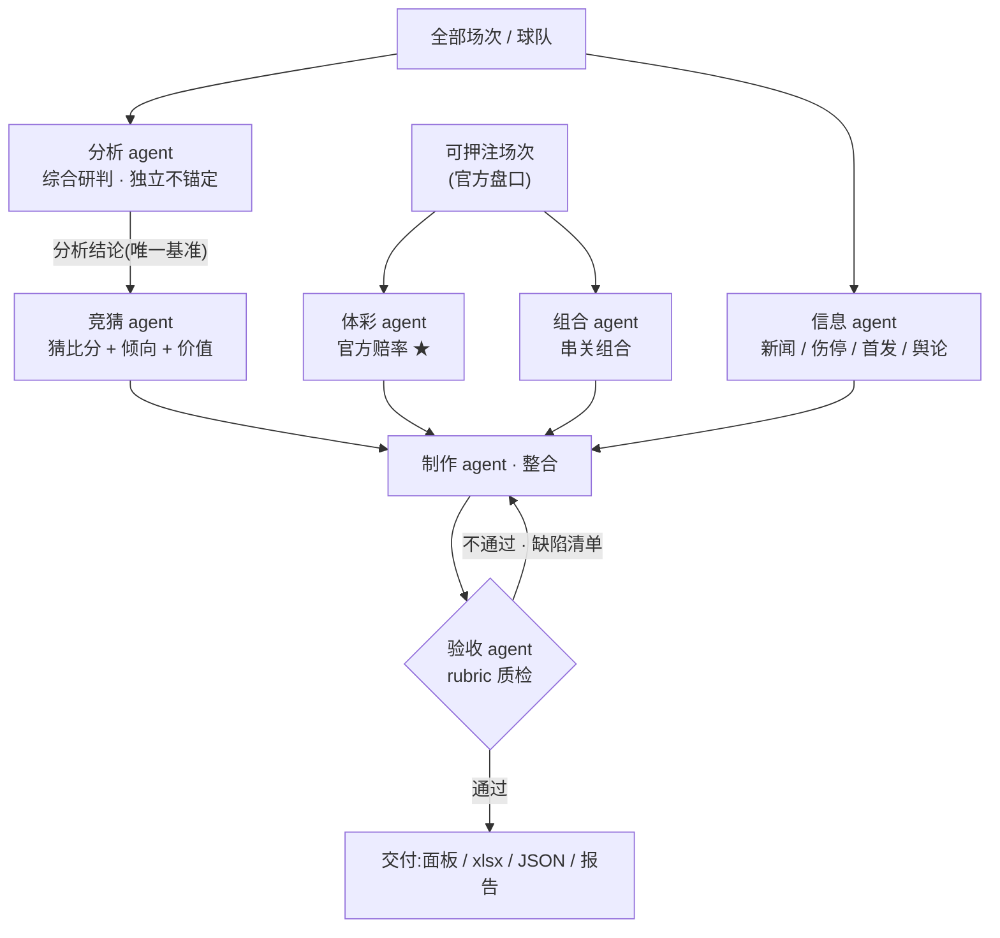

<div align="center">

# ⚽ AI-Agent-Lottery-Betting-FIFA-World-Cup

### 2026 世界杯 · 竞猜投注助手(多 Agent 体系)

*An HTML locally-deployed website that integrates all the World Cup lottery information, aiming to help bettors make better choices.*

[](LICENSE)
[](#)
[](#)
[](#)
[](#)
[](#)

</div>

---

## 📖 项目简介

本项目是一个**纯前端、可本地部署**的 2026 世界杯竞猜投注辅助系统,最重要的目标只有一个:**辅助体彩竞猜押注**。它把全部 104 场赛程、竞彩官方赔率、球队大名单与首发、伤停舆情、历史交锋与本届实时战况,整合进一个可双击打开的单文件网页 `index.html`,并配套一份多工作表的结构化 Excel 数据库。

与普通"赛事面板"不同,本项目的数据与研判由一套**多 Agent 协作体系**生产:分析、竞猜、体彩、组合、信息五类生产 Agent 各司其职,经制作 Agent 整合、验收 Agent 按 rubric 把关后才交付到面板。整个流程遵循一条不可逾越的红线——**绝不编造数据**:抓不到的标「待更新」,模型推算的标「参考·模型」,竞彩官方实测的标「★竞彩官方」并注明来源与抓取时间。

> ⚠️ **理性娱乐,未成年人禁止购彩。** 面板所有奖金均为税前理论值,实际开奖以中国体育彩票官方为准。

---

## ✨ 核心特性

面板(`index.html`)是一个自包含的单页应用,无需后端、无需安装,双击即用,包含八个功能页签:**竞猜投注、比赛详情/观赛/分析、组合计算、赛程比分、小组排名、球队总表、全国竞猜活动、新闻**。投注页支持竞彩全玩法(胜平负、让球胜平负、比分、总进球、半全场),内置可勾选赔率的**串关/单关计算器**(单注基准 2 元,自动按所选赔率连乘或求和算奖)。

数据层做到**三处一致**:同一场比赛的数据在「单场 JSON ↔ 面板 `M` 数组 ↔ Excel ⑩ 单场详情」三处必须完全相同,改一处即同步三处。页面右下角还内置一个**嵌入式 AI 助手**(`世界杯AI助手.js`),支持悬浮窗对话、选中文本提问、自动切页/查找/读取页面,默认走 Puter·GLM 免 Key 运行,可热插拔技能 / 连接器 / MCP。

整套数据通过**分级定时任务**自动维护:每天 17:00 全量刷新,临场按小时→半小时→10 分钟逐级加密刷新赔率,赛后约 6 小时回填单场数据库。主动更新仅在**北京时间 11:00–22:30** 进行。

---

## 🧩 多 Agent 体系

项目的核心是 `子代理体系/` 下定义的协作流水线。各 Agent 既是可移植的标准子代理定义,也是主 Claude 可按段执行的 SOP。

| Agent | 职责 | 处理对象 |
|---|---|---|
| **分析 agent** | 全场次综合研判:综合新闻 / 短视频 / 资讯 / 大名单 / 客观数据,重点结合本届实际战况(小组赛看出线与对决,淘汰赛看形势)。**独立不锚定**,可与赔率、积分相反 | 全部场次 + 全部球队 |
| **竞猜 agent** | 据分析 agent 结论猜比分(pred),派生胜平负 / 让球 / 总进球 / 半全场倾向与价值、凯利 | 未开赛场次 |
| **体彩 agent** | 竞彩官方赔率全玩法,区分「★官方」与「参考·模型」 | 可押注场次 |
| **组合 agent** | 串关组合计算:按目标收益枚举达标组合,概率排序 + 分类 | 可押注场次 |
| **信息 agent** | 新闻 / 自媒体 / 伤停 / 首发 / 舆论的跨平台抓取与初筛 | 全部场次 |
| **制作 agent** | 整合五方产出 → 面板 HTML / xlsx / 单场 JSON / 报告 docx | 交付物 |
| **验收 agent** | 按 rubric 质检,不合格令制作 agent 重构后复验(≤3 轮) | 交付物 |

数据流如下——分析结论是竞猜的**唯一基准**(竞猜读分析,分析不读竞猜),最终所有产出都要过验收这一关:



---

## 🗂️ 项目结构

| 路径 | 说明 |
|---|---|
| `index.html` | **核心面板**。自包含单文件,浏览器双击即开,含全玩法赔率、投注计算器、比赛详情、历史战绩、分析预测 |
| `世界杯AI助手.js` | 嵌入式 AI 助手本体(样式 + 界面 + 双 Provider + 技能引擎) |
| `2026世界杯数据库.xlsx` | 多工作表结构化数据库(竞猜、赛程比分、小组排名、球队、大名单、首发、新闻、分析预测、近期战绩等) |
| `子代理体系/` | 七大 Agent 定义 + `README_编排.md` 编排说明 |
| `比赛数据库/` | 单场比赛 JSON 数据库(录像 / 红黄牌 / 阵型 / xG 等客观数据 / 分析 / 赔率 / 来源),含模板与验收报告 |
| `docs/官方数据抓取指南.md` | 用 Claude in Chrome 调体彩官网取官方数据的唯一指定方法 |
| `部署/` | 本地、局域网(微信扫码)、公网三类部署脚本与说明 |
| `CLAUDE.md` · `项目说明_维护手册.md` · `能力与自主性清单.md` | 常驻工作准则、维护手册、能力清单 |
| `glm-proxy.mjs` · `AI助手_演示.html` · `AI助手_使用说明.md` | 可选 GLM 代理、助手离线演示页与使用说明 |

---

## 🔌 官方数据获取(竞彩赔率 + 赛程)

竞彩官方 SP **只能**经浏览器在体彩官网同源调用官方接口取得——`web_fetch`、`WebSearch`(仅美区)、`curl/python` 直连均取不到。因此官方数据的唯一指定路径是:在 Chrome 安装并连接「Claude in Chrome」插件,`navigate` 到 `sporttery.cn` 取得 tabId 后,在页面上下文内 `fetch` 官方接口 `getMatchCalculatorV1.qry?poolCode=had,hhad,crs,ttg,hafu`,即可拿到五玩法赔率与在售赛程,再按字段映射写入面板。详见 [`docs/官方数据抓取指南.md`](docs/官方数据抓取指南.md)。

竞彩售卖规则同样内置到面板状态机:每天 11:00 开售次三日、22:00(周末 23:00)封次日盘,等价于每场「开盘 = 赛前第 3 天 11:00、封盘 ≈ 赛前一晚 22:00」,最终以接口实际在售列表为准。

---

## ⏰ 定时任务

所有时间均为**北京时间**,主动更新仅 11:00–22:30,其余时段静默。

| 任务 | 频率 | 作用 |
|---|---|---|
| `worldcup-2026-daily-update` | 每天 17:00 | 全量:比分 / 排名 / 名单首发 / 新闻 / 历史战绩 / 分析预测 / 淘汰剔除 |
| `wc-odds-*`(分级) | 11–13 点每时 → 14–20 点每半时 → 20–22 点每 10 分 | 临场赔率与即时比分逐级加密刷新 |
| `wc-outright-odds` | 小组赛每 3 天 / 淘汰赛起每天 | 冠军、冠亚军盘 |
| `wc-match-db-6h` | 12 / 15 / 18 / 22 点检查 | 赛后约 6 小时回填单场 JSON + xlsx⑩ + 面板 M,并验收 |

---

## 🚀 快速开始

最简单的方式是直接双击根目录的 `index.html` 用浏览器打开,它读取的就是会被定时任务更新的原文件,刷新即见最新。

若要在**手机 / 微信**(同一 WiFi)查看,运行 `部署/1-本地与微信局域网(自动更新)/` 里的扫码脚本,手机扫码即可打开,同样自动更新。若要分享到**公网**,用 `部署/2-公网上传快照(需重传更新)/` 生成快照并拖到 Netlify Drop——注意公网托管的是快照副本,数据更新后需重新上传(或用内网穿透把本地自动更新的服务暴露为公网地址)。详见 [`部署/部署总说明.md`](部署/部署总说明.md)。

---

## ⚙️ 配置与注意事项

### API Key 需自行替换

**本仓库不内置任何密钥。** 嵌入式 AI 助手默认走 **Puter 模式**(浏览器原生、免 API Key、免费,user-pays,首次可能弹出 Puter 登录),克隆后开箱即用。若要改用 **GLM 官方**接口,需到 [bigmodel.cn](https://bigmodel.cn) 免费注册,并在面板「**⚙ 设置 → Provider 选 GLM 官方**」中填入**你自己的 API Key**(代码里 `glmKey` 默认为空,不存在可直接套用的现成 Key)。Key 仅保存在你本机浏览器的 `localStorage`,**不会上传、也不应提交到仓库**——`.gitignore` 已排除 `*.local`、`.env`、`secrets.*` 等,请勿把 Key 或内网穿透 token 写进任何会被提交的文件。

浏览器从本地 `file://` 直连 `open.bigmodel.cn` 可能被 **CORS** 拦截。最省事的办法是直接用默认 Puter 模式;若坚持用 GLM 官方 Key,可运行随附的零依赖本地代理 `node glm-proxy.mjs`(需 Node 18+),再把请求端点 `glmBase` 改为 `http://localhost:8787/v4/chat/completions`——该代理只做透传 + 补 CORS 头,不存储任何密钥。更多细节见 [`AI助手_使用说明.md`](AI助手_使用说明.md)。

### 定时任务需自行配置

上文「定时任务」表中的各 cron 任务依赖 Claude 桌面端的计划任务能力,**仅在桌面 App 打开时运行**;首次联网需授权,建议每个任务先点一次 **Run now** 预授权。所有时间均为**北京时间**,主动更新只在 **11:00–22:30**,其余时段静默。若你 fork 本项目,需在自己的环境**重新建立**这些任务;同时注意**避免重复任务**——例如旧的通用 `data` 任务若与 17:00 全量任务时间重叠,应禁用或删除,以免重复运行。

> 🔐 **小结**:Key 自备、只存本机、永不入库;定时任务自建、仅 App 开启时按北京时间窗口运行。

---

## ⚖️ 免责声明

本项目仅用于个人学习、技术研究与赛事信息聚合,所有赔率、比分、奖金均为参考或税前理论值,**实际以中国体育彩票官方开奖为准**。请遵守所在地区法律法规。

**理性娱乐,量力而行,未成年人禁止购彩。**

---

## 📄 License

本项目基于 [MIT License](LICENSE) 开源。

```
MIT License · Copyright (c) 2026 Yang LI
```

---

## ⭐ Star History

[](https://star-history.com/#Leo601836/AI-Agent-Lottery-Betting-FIFA-World-Cup&Date)

<div align="center">

如果这个项目对你有帮助,欢迎点一个 ⭐ Star 支持一下!

</div>
